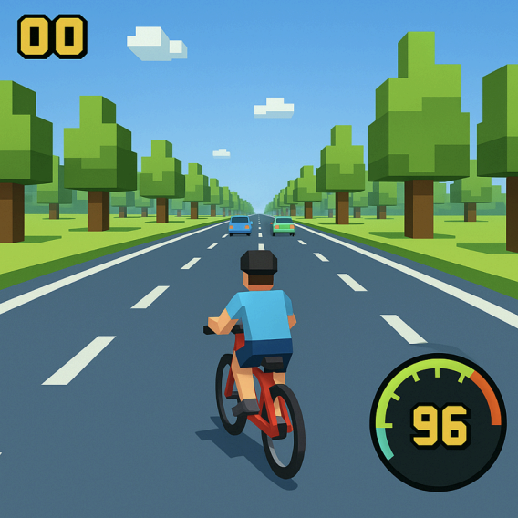
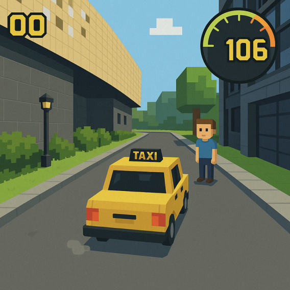
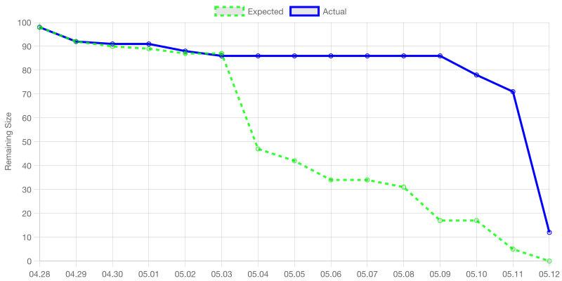
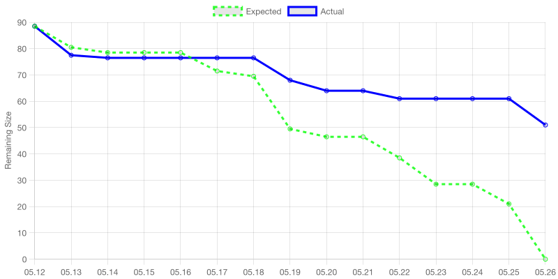
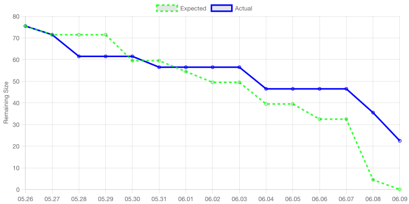
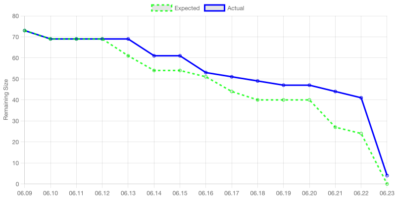
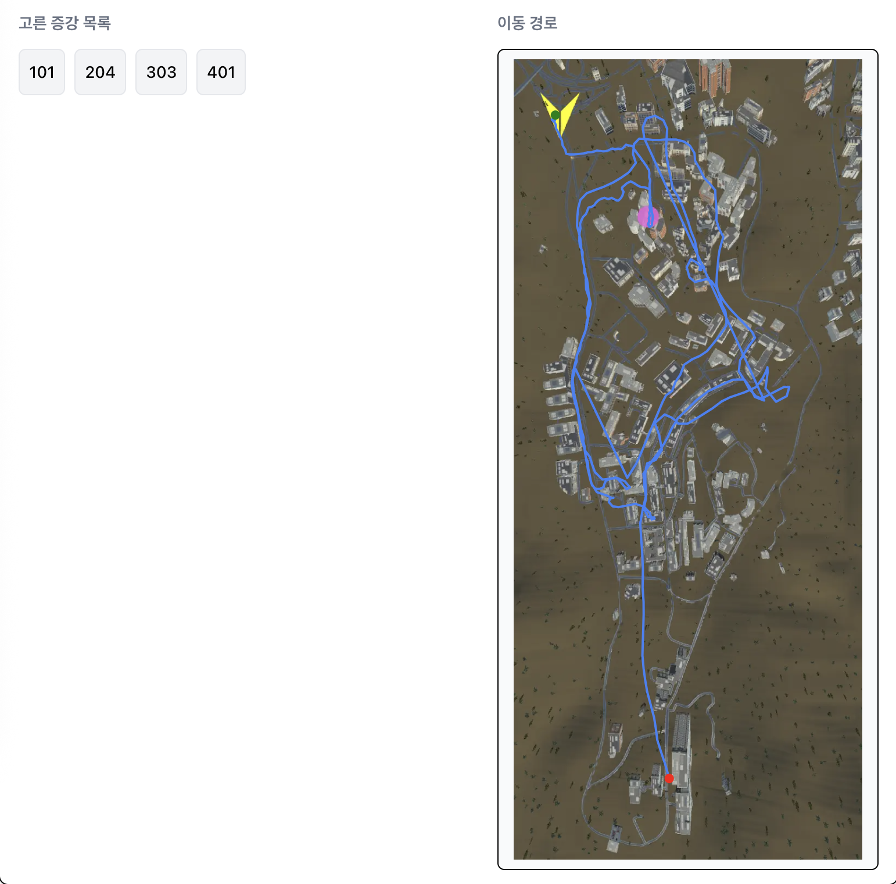

# 2025년 봄학기 소프트웨어 개발의 원리와 실습 최종 보고서

### 게임명: `School Rush`

학교를 신나게 달리는 게임이라는 뜻에서 `School Rush` 로 정했습니다.

### 팀명: `칠리페퍼`

7이 들어가는 단어 중 어감이 좋아 칠리페퍼로 정했습니다.

### 구성원

| 이름   | 역할          | 보유 스킬                 |
| ------ | ------------- | ------------------------- |
| 우현민 | PM            | 아키텍처, Git, TypeScript |
| 곽승연 | 개발, 디자인  | Java, Python, FastAPI     |
| 조재표 | 개발, 맵 제작 | C#, Python                |
| 장호림 | 개발, 사운드  | C#, 편곡                  |
| 문지환 | 개발          | C#, Python, JavaScript    |

# 프로젝트 제안서

> 이 섹션에서는 4월에 제출하였던 초기 프로젝트 제안서를 확인할 수 있습니다.
> 기획 변경에 따라 변경된 부분들도 있습니다.

## 게임 소개

### 스토리

학교에서 열릴 중요한 연구 발표를 준비하며 302동으로 향하던 중 **관악캠퍼스 곳곳에서 발생하는 이상 현상**에 대한 소문을 듣는다. 여러 목격담이 있었으나 별다른 공지는 없었고, 문제를 해결하기 위해 특별한 능력을 가진 동료들을 찾아 학교의 문제를 해결하러 출발한다.

### 요약 설명

- School Rush 는 **증강시스템과 오픈월드 기반의 레이싱 게임**으로, 목적지에 도달할 때까지 5곳의 체크포인트를 지나며 동료를 한 명씩 태웁니다.
  - 증강 시스템: 동료를 한 명 태울 때마다 증강을 고를 수 있으며 이를 통해 차량을 강화하여 목적지에 도달합니다.
  - 오픈월드: 이동 경로가 정해져 있지 않고, 사용자가 직접 판단하고 선택할 수 있습니다.
- 증강 시스템에 의해 게임 초반, 중반, 후반의 재미 포인트가 조금씩 달라집니다. 동료를 한 명 한 명 모을수록 증강을 얻어 능력치를 향상시킬 수 있습니다.
  - 게임 초반에는 동료를 아직 다 모으지 못했기에 증강이 부족한 상태이므로 모든 패널티를 신경써야 합니다. 지나가는 행인이나 자동차를 최대한 피해야 하고 이 때문에 주행 속도가 느립니다.
  - 운이 좋아 좋은 증강을 모으게 된다면 게임 후반에는 궁극적으로 날아다니는 수준에 준하는 능력치를 얻게 됩니다. 일반적으로 **게임 후반으로 갈수록 더 속도감 있는** 게임을 즐길 수 있습니다.
  - 사용자는 초반에 도움이 되는 증강을 골라서 초반 구간을 빠르게 넘길지, 후반에 도움이 될 증강을 일찍부터 골라서 후반 구간을 더 빠르게 넘길지 선택해야 합니다. 또한 사용자의 실력에 따라서도 증강을 선택하는 기준이 바뀔 수 있는데, 가령 컨트롤 능력이 좋다면 장애물을 제거하는 증강이 큰 의미가 없지만 그렇지 않다면 장애물을 제거하는 증강이 매우 중요합니다. 또한 증강은 랜덤하게 등장하기에, 결정한 전략이 항상 통하는 것은 아니라는 점에서 **랜덤성**이 있습니다.
- 오픈 월드 게임의 방식을 차용하여, 게임의 모든 경로는 정해져 있지 않고 **가고 싶은 경로를 스스로 찾아 이동**할 수 있습니다.
  - 가령 지금 위치가 경영대이고 다음 체크포인트가 노천강당이어서 해당 장소로 이동해야 하는 경우, 도로를 따라 기숙사삼거리를 지나 올라갈 수도 있지만 직선거리로 주파할 수도 있습니다. 사용자는 이런 전략들을 선택할 수 있으며 중 어떤 것이 더 유효한지 확인하며 재미를 느낄 수 있습니다.
- 기본적인 레이싱 스킬, 증강 선택, 학교라는 방대한 맵에서 길의 너비나 동선 등을 고려하여 적절한 경로를 찾는 것 모두가 게임 결과에 영향을 미치기에 이런 다양한 조건 하에서 기록을 세우는 것에서 재미를 느낄 수 있습니다.
- 랭킹 대시보드 기능을 통해 다른 유저의 기록, 해당 기록을 세우기 위해 고른 증강들, 이동 동선을 확인할 수 있습니다.
  - 다른 사람의 기록을 **공략으로 참고**할 수 있습니다. 이를 통해 발전할 수 있는 환경을 제공합니다.
  - 다른 사람의 기록을 목표로 세울 수 있습니다. 이를 통해 **경쟁심을 자극**합니다.
- 플레이 타임은 숙련자 기준 5분 내외입니다.

### 타겟 사용자

- 싱글플레이 기반이므로 가볍게 즐길 수 있는 중독성 있는 킬링타임용 게임을 지향합니다. 과제를 진행하다가 잠시 머리를 식히고 싶을 때 한 판만 해 볼까? 하고 들어와서 한 시간을 하게 되는 게임이 될 것입니다.
- 맵이 서울대학교 관악캠퍼스라는 점이 게임의 가장 큰 소구 포인트이기에, 맵이 익숙할 **서울대학교 관악캠퍼스 학생들**이 크게 흥미를 느낄 것으로 예상하여 이들을 주로 타겟합니다.

### 경쟁 게임 및 차별성

- 실시간 경쟁 요소가 없는 싱글 플레이 레이싱 게임이라는 장르에서, 경쟁게임으로는 카트라이더 타임어택모드나 아스팔트8가 있습니다.
- 경쟁 게임들 중 카트라이더의 경우 드리프트/부스터 시스템에 대한 높은 이해도를 바탕으로 한 컨트롤이 중요하고, 아스팔트의 경우 다른 차량을 파괴하고 부스터를 획득하는 게 중요합니다.
- 이런 반면 School Rush 는 맵의 난이도는 비교적 쉬우나, 증강과 동선을 전략적으로 선택하는 게 중요한 요소입니다. 맵의 동선을 다양하게 설계할 수 있고 증강 시스템이 통해 **창의적인 플레이**를 할 수 있는 요소가 더 많다는 것에서 차별성을 가집니다.

## 유저 스토리

### 닉네임 등록 및 관리

- _사용자로서,_ 게임에 처음 입장할 때 닉네임을 설정할 수 있습니다. 이는 플레이 완료 후 게임 결과를 랭킹 대시보드에 올리기 위함입니다.
- _사용자로서,_ 이전에 이미 해당 기기에서 닉네임을 입력한 적이 있다면 닉네임 설정 과정을 건너뛸 수 있습니다. 이는 닉네임 입력 단계의 번거로움을 해소하기 위함입니다.
- _사용자로서,_ 기존에 입력한 닉네임을 없애고 새로운 닉네임을 등록할 수 있습니다. 이는 동일한 기기에서 서로 다른 사람들이 플레이할 경우 모두가 각자 사용하고 싶은 닉네임을 사용할 수 있게 하기 위함입니다.

### 게임 플레이

- _사용자로서,_ 관악캠퍼스 정문에서 게임을 시작합니다.
- _사용자로서,_ 전체 화면 맵을 열어 다음 목표 체크포인트의 정확한 위치를 확인할 수 있습니다. 이는 동료들을 찾아가는 동선을 결정하기 쉽게 하기 위함입니다.
- _사용자로서,_ 우측 하단 미니맵에서 다음 목표 체크포인트의 방향과 남은 거리를 확인할 수 있습니다. 이는 이동하는 동안 빠르게 동선을 판단하는 것을 돕기 위함입니다.
- _사용자로서,_ 하나의 체크포인트에 도달할 경우 미니맵과 전체 화면 맵에서 다음에 찾아가야 하는 체크포인트 위치가 업데이트되어 확인할 수 있습니다.
- _사용자로서,_ 동료들이 공개되는 위치와 순서는 모든 게임에서 동일한 것을 확인할 수 있습니다. 이는 사용자가 동선을 설계하는 것을 돕고, 게임 결과와 유저의 실력이 운에 과하게 의존하는 것을 방지합니다.
- _사용자로서,_ 캠퍼스 내의 행인, 차량, 돌진하는 차량, 구덩이 등의 장애물을 마주치게 되고 각 장애물을 피해야 합니다. 이는 게임을 어렵고 도전적이게 만들어주는 주요 요인이 됩니다.
- _사용자로서,_ 행인과 부딪힐 경우 이전 체크포인트로 돌아가는 패널티를 얻습니다. 이는 행인과 절대 부딪히지 않도록 플레이하게 되는 요인이 되어 주며, 행인 무시 증강을 획득해야 할 이유가 됩니다.
- _사용자로서,_ 차량과 부딪힐 경우 뒤로 튕겨나 잠시 기절합니다. 이는 주행하면서 차량과 부딪히는 걸 최대한 피해야 할 요인이 되며, 게임에 박진감을 부여합니다.
- _사용자로서,_ 이동 시 드리프트와 부스터를 적절하게 활용할 수 있으며 이는 컨트롤 능력에 기반하여 더 좋은 게임 결과를 가질 수 있게 해 줍니다.
- _사용자로서,_ 화면 하단에서 실시간으로 기록을 확인할 수 있습니다. 이는 지금까지 걸린 시간을 확인하여 기록을 세우는 데 목표감을 주기 위함입니다.
- _사용자로서,_ 동료를 차에 태우면 동료가 제안하는 세 가지 증강 중 하나를 선택할 수 있습니다. 이를 통해 게임의 핵심인 증강 시스템을 제공받을 수 있습니다. 증강을 선택하는 데 걸린 시간은 기록에 포함되지 않기에 신중하게 전략적으로 증강을 선택할 수 있습니다.
  - 이때 증강의 모든 종류는 사전에 결정되어 있으며 [위키의 증강 문서](https://github.com/SWPP-2025SPRING/team-project-for-2025-spring-swpp-team-07/blob/main/wiki/4.AUGMENTS.md?plain=1)에서 확인할 수 있습니다.
  - 증강은 한 번 선택하면 되돌릴 수 없습니다.
- _사용자로서,_ 주행 시 증강 시스템에 따른 버프 효과가 적용됩니다.
- _사용자로서,_ esc 키를 통해 게임을 일시중지할 수 있으며 일시중지할 경우 현재까지 선택한 증강 목록을 확인할 수 있습니다.
- _사용자로서,_ 게임을 일시중지했을 때 메인 메뉴로 돌아가거나 게임을 재시작할 수 있습니다. 선택을 잘못하여 게임을 빠르게 다시 시작하고 싶을 경우 이 기능을 활용하여 게임이 지루해지지 않게 유지할 수 있습니다.
- _사용자로서,_ 마지막에 모든 동료를 태운 다음 302동으로 가서 목표를 달성할 수 있습니다.
- _사용자로서,_ 게임이 종료되면 기록과 증강, 위치를 초기화하여 게임을 다시 시작하거나 메인 화면으로 돌아갈 수 있습니다.

### 랭킹 대시보드

- _사용자로서,_ 게임 종료 후 플레이 기록을 확인할 수 있습니다.
- _사용자로서,_ 게임 종료 후 플레이 기록이 자동으로 랭킹 대시보드에 업로드됩니다.
- _사용자로서,_ 메인화면에서 랭킹 대시보드로 진입하여 대시보드를 확인할 수 있습니다. 대시보드에는 게임 플레이 결과 가장 빨리 목표를 달성한 유저 순서대로 해당 유저의 닉네임, 플레이 시간, 선택한 증강 목록, 이동 동선을 확인할 수 있습니다. 이를 통해 다른 유저의 전략을 확인하고 내 전략에 적용하고 개선하여 내 기록을 향상시킬 수 있습니다.

## 예상 게임 화면 혹은 컨셉

- 시중에 있는 게임으로는 게임 개발사 힐스턴 웨일에서 출시한 길건너 친구들과 유사한 테마의 그래픽으로 진행 예정입니다.
- 음향은 일렉 장르의 배경음악을 제작하여 사용할 예정입니다.
- 게임 플레이 화면의 예시 이미지는 아래와 같습니다.

| 게임 시작                  | 동료 탑승 (체크포인트)     | 최종 증강을 고른 후        |
| -------------------------- | -------------------------- | -------------------------- |
|  |  |  |

## 타겟 환경 및 기대 사양

- PC에 설치해서, 혹은 웹으로 가볍게 플레이하는 게임입니다.
- CPU Intel Core i5-8500 이상, GPU NVIDIA GTX 960 이상, RAM 8GB 이상, 저장
  공간 10GB 이상이라면 원활한 플레이가 가능할 것으로 기대합니다.

## 프로덕트 백로그

### 맵

- 서울대학교 관악캠퍼스를 그대로 본뜬 맵의 지형도를 사용하여 Blender에 맵 제작
- 관악캠퍼스 주요 도로 적용
- 서울대학교 건물 위치와 모양을 간소화하여 맵에 적용
- 관악캠퍼스 주변 지형지물과 난간, 가로수 등 asset을 적절하게 적용

### 디자인

- 차량 에셋 제작
- 차량 에셋 적용
- 사람 (주인공, 동료) 에셋 제작
- 사람 에셋 적용
- 주요 건물 에셋 제작
- 주요 건물 에셋 적용
- 일반 건물 공통 에셋 제작
- 일반 건물 공통 에셋 적용

### 사운드

- 기본 배경 BGM 제작
- 기본 배경 BGM 적용
- 특수 효과 BGM 제작
- 각 특수 효과 BGM 적용

### 개발환경

- CI 파이프라인 구축
- CD 파이프라인 구축
- 개발자들간 작업환경 통일 작업
- 슬랙봇을 통해 슬랙 기반 스크럼을 진행할 수 있도록 구현
- 슬랙봇을 통해 코드 리뷰 리마인드 파이프라인 구축
- 슬랙봇을 통해 각종 Agile 지표 수치화하여 대시보드 제작

### 게임 메인 화면 구현

- 게임 플레이 및 랭킹 대시보드의 진입점이 되는 메인 화면 마련
- 닉네임 입력 로직 구현
- 닉네임 변경 로직 구현
- 랭킹 대시보드에서 저장된 기록 보여주기 구현

### 게임 플레이 구현

- 증강 시스템
- 증강 요소 목록 결정
- 증강 시스템 구현
- 주변 행인 행동 구현
- 주변 행인 충돌 시 이전 체크포인트로 돌아가는 로직 및 특수효과 구현
- 주변 차량 행동 구현
- 주변 차량 충돌 시 튕겨나는 로직 및 특수효과 구현
- 방향키를 통한 기본 조작 구현
- 벽, 건물 등 장애물 충돌 시 로직 구현
- 현재 소요 시간, 현재 속도, 가속력 등 스탯을 보여주는 ui 구현
- 미니맵 구현
- 미니맵에 동료 위치 보여주기 구현
- 키보드 M키를 통해 진입하는 전체화면 맵 구현
- 전체화면 맵에 동료 위치 보여주기 구현
- 드리프트 기능 구현
- 드리프트 후 부스터 사용 구현
- 시작 지점에서 게임 시작 구현
- 도착 지점 도착 시 게임 종료 및 재시작 구현
- 게임 일시중지 뷰 구현
- 게임 일시중지 후 재시작 구현
- 게임 일시중지 후 메인 메뉴로 이동 구현
- 게임 일시중지 시 상세 스탯 및 선택한 증강 목록 확인 기능 구현
- 게임 종료 시 기록 저장 구현

## 개발 일정

> 게임의 밸런스 조정이 게임 플레이에 중요하기 때문에, 모든 스프린트에서 플레이 가능한 게임이 나오는 것을 목표로 하며, 각 스프린트마다 게임을 많이 플레이하며 개선점을 찾고 추가적인 태스크로 만들어야 합니다.

### Sprint 1 (4/28 - 5/11)

- 목표
  - 플레이 가능한 최소한의 게임 완성
  - CI/CD 파이프라인 구축
  - 팀 개발 문화 정립 및 성공적인 첫 사이클 수행
- 태스크
  - 게임 메인메뉴 구현
  - 맵 1차 제작
  - 배포 파이프라인 구축
  - 프로젝트 초기 셋업 마무리
  - 방향키를 통한 조작과 결승점 도달 시 게임 종료 구현
  - 스크럼, 코드리뷰 리마인드, Aglie 스탯 확인 역할을 하는 슬랙봇 구현
- 특이사항
  - 첫 sprint 이기에 역량이나 경험 부족에 의한 추가적인 buffer가 많이 필요할 것으로 예상합니다.

### Sprint 2 (5/12 - 5/25)

- 목표
  - 게임의 핵심 시스템 구현
  - 내부 테스트를 통한 밸런스 및 기획 조정 준비
- 태스크
  - 증강 시스템과 동료 픽업 체크포인트 초기 구현
  - 게임 일시중지 구현
  - 미니맵과 전체화면 맵 구현
  - 내부 베타 테스트 결과 개선점 반영
  - 드리프트와 부스터를 통한 조작 구현
  - 적절한 테스트코드 및 아키텍처를 위한 refactoring buffer
- 특이사항
  - 본격적으로 개발에 속도가 붙는 주기일 것으로 예상합니다.

### Sprint 3 (5/26 - 6/08)

- 목표
  - 게임의 완성도 보완
  - 기획 보완을 통한 스펙 마무리 단계
- 태스크
  - 맵, 차량, 사운드 등 에셋 마무리
  - 증강 시스템 완성
  - 내부 베타 테스트 결과 개선점 반영
  - 버그 수정
  - 적절한 테스트코드 및 아키텍처를 위한 refactoring buffer
- 특이사항
  - 가장 많은 개발을 하는 주기일 것으로 예상합니다.

### Sprint 4 (6/09 - 6/22)

- 목표
  - 게임의 완성도 보완
  - 랭킹 대시보드 완성
- 태스크
  - QA 및 QA 대응 작업
  - 랭킹 대시보드 구현
- 특이사항
  - 다른 과목들의 시험기간과 과제 집중기간도 모두 겹치는 시기이기에 코드를 많이 작성하기보다는 완성도를 높이는 작업에 집중하게 될 것으로 예상합니다.

## 형상관리계획

- Unity 소스코드
  - 버전 관리: Git 과 GitHub를 사용합니다.
  - 모든 개발자의 Unity 버전을 2021.3.45f1 으로 통일하여 각 개발자의 개발 환경을 통일합니다.
- 스펙 문서 등 문서
  - 마찬가지로 Git 과 GitHub를 사용하며, 위 Unity 소스코드와 동일 Repository의 `/docs` 경로에서 관리하여 DocOps를 적용합니다.
- 소스코드와 문서에 대한 Git 컨벤션
  - GitHub Flow 와 Trunk Based Development 를 결합한 형태를 사용합니다.
  - `main` 브랜치를 기반으로 Pull Request 를 올리고 리뷰 후 merge합니다. `main` 브랜치로의 직접적인 push는 막혀 있습니다.
  - Trunk Based Development를 차용하여, 각 Pull Request 변경사항에서 C# Script 의 길이가 최대 300줄이 넘지 않도록 제한합니다. 이를 통해 각 브랜치의 변경 사항이 너무 커져서 Merge 시 충돌이나 병목이 생기는 상황을 방지합니다.
  - 큰 변경 사항을 Merge 해야 할 경우, 변경 사항을 Feature Flag 를 활용하여 숨겨서 Merge합니다.
  - Pull Request에 대해 CI를 설정하여, 자동화 테스트 및 코드 정적 분석을 수행합니다.
  - `main` 브랜치에 머지 시 자동으로 테스트 배포환경에 게임이 배포되도록 CD 파이프라인을 설정합니다.
  - 소스코드가 변경되어 문서의 변경이 필요할 경우 동일한 Pull Request에서 함께 변경하여 제품의 변경을 추적합니다.
- Blender Asset
  - 따로 버전관리하지 않고, 담당하는 조원의 로컬에 관리합니다.
  - 필요 시 export하여 조 내에서 공유합니다.

## 테스팅

- view model, usecase, entity 로직에 대한 **자동화 단위 테스트**를 수행합니다.
  - 가령, 특정 증강들을 선택했을 때의 스탯이나 현재 주행 중인 차량 정보 등이 포함됩니다.
  - 이런 테스트를 적절하게 수행할 수 있도록 각 항상 의존성은 직접 의존하는 대신 의존받아 사용하고, view 관련 로직은 적절하게 험블하게 처리한 아키텍처를 구축해야 합니다.
  - 또한 이런 아키텍처를 구축하는 데 도움이 되기 위해 Test Driven Development 방식을 사용합니다. 이를 통해 부가적인 가치로 모듈의 결함율이 감소하는 효과도 얻을 수 있습니다.
- 게임이니만큼 **자동화된 e2e 테스트를 적용하기는 어렵다**고 생각합니다.
  - 전체적인 게임 플레이에 대한 자동화 e2e 테스트는 진행하지 않습니다.
  - 대신 개발자들이 원하는 시점에 최신 프로덕트를 플레이하고 이슈를 제보할 수 있도록, 적절한 배포 파이프라인과 테스트 파이프라인을 구축하는 것을 지향합니다.

# 스프린트별 계획과 회고 회의

> 각 스프린트별로 계획 회의 - 회고 회의 - 백로그 변경의 순서로 펼쳐 정리 취합하였습니다.

> 태스크 할당 표에서 예상 소요시간을 스토리 포인트로 사용했습니다.

> `스프린트 회고 진행` 등 선정 이유가 당연한 태스크는 이유를 생략했습니다.

## 스프린트 1 계획 회의

### 스프린트 백로그 및 태스크 선정 이유

Sprint 1의 주요 목표는 팀의 개발 문화를 정립하는 것과 플레이 가능한 최소 사이즈의 게임을 제작하는 것이었습니다.

- 팀 문화 측면에서 Agile 을 적극적으로 도입하고자 하였습니다. Agile 의 실천 방식 중 "데이터를 많이 만들고 계기판을 통해 직원들이 자주 지나다니는 곳에 자주 노출할 것"이 있습니다. 본 프로젝트 팀에 물리적으로 출퇴근을 하는 업무 공간은 없으므로 실제 공간 대신 슬랙 채널을 통해 이를 달성하고자 하였고, 따라서 스크럼 슬랙봇을 제작하여 매일 아침마다 슬랙에 Burn Down Chart를 보내도록 처리하기로 했습니다.
- 또한 매 스프린트마다 동작하는 결과물을 제작함으로써 개발 프로세스가 잘 진행되고 있다는 것을 가시적으로 확인하고자 하였고, 이를 위해 그래픽, 사운드, 조작 모든 면에서 플레이 가능한 최소 사이즈의 게임을 제작하는 것을 목표로 하였습니다. 따라서 최소한의 그래픽을 적용할 수 있도록 주인공 에셋을 제작하는 태스크를, 최소한의 사운드를 확인할 수 있도록 기본 BGM을 적용하는 태스크를 잡았습니다. 게임 플레이 측면에서는 게임을 한 바퀴 완주할 수 있도록 구현하는 것을 목표로 여러 태스크들을 잡았습니다.
- 본 게임은 맵의 완성도가 매우 중요하기 때문에 맵 제작에 많은 리소스를 집중해서 사용할 수 있도록, 팀원 한 분이 맵 제작 자동화를 전담해서 진행해주시기로 하였습니다.

### 개인별 가용시간

| 조원   | 가용시간 | 할당된 태스크 예상 시간 합계 |
| ------ | -------- | ---------------------------- |
| 우현민 | 20시간   | 15시간                       |
| 곽승연 | 30시간   | 20시간                       |
| 조재표 | 30시간   | 44시간                       |
| 장호림 | 20시간   | 17.5시간                     |
| 문지환 | 30시간   | 19시간                       |

### 태스크 할당 표

| 태스크                                          | 담당자 | 예상 소요시간 | 선정 이유                            |
| ----------------------------------------------- | ------ | ------------- | ------------------------------------ |
| 스프린트 1 계획 회의 준비                       | 우현민 | 3             | -                                    |
| 스프린트 1 계획 회의 진행                       | 전체   | 2             | -                                    |
| Unity Project 생성                              | 장호림 | 0.5           | 초기 설정 진행                       |
| 스크럼 & 코드리뷰 리마인더 슬랙봇               | 우현민 | 1             | 팀 문화 정립                         |
| C# 코드 포매팅 CI workflow 구축                 | 우현민 | 2             | 불필요한 체인지가 생기지 않도록 처리 |
| 디자인 기본 컨셉 고민해서 공유                  | 곽승연 | 1             | 디자인 작업 시작 온보딩 태스크       |
| 맵 초안 제작 및 적용                            | 조재표 | 40            | 맵 작업 시작 온보딩 태스크           |
| 게임 시작, 차량 및 카메라 시점 구현             | 문지환 | 1             | 게임 기초 기능 구현 온보딩           |
| 게임 메인 화면 구현                             | 문지환 | 1             | 게임 기초 기능 구현                  |
| 닉네임 입력 구현                                | 문지환 | 1             | 게임 기초 기능 구현                  |
| 게임 일시중지 기능 구현                         | 문지환 | 1             | 게임 기초 기능 구현                  |
| Burn Down Chart 매일 아침 슬랙으로 전송         | 우현민 | 2             | 팀 문화 정립                         |
| 기본 배경 BGM 제작 및 적용                      | 장호림 | 10            | 사운드 작업 시작 태스크              |
| 방향키를 통한 기본 조작 + 드리프트/부스터 구현  | 문지환 | 8             | 게임 기초 기능 구현                  |
| 기본 차량 에셋 제작 및 적용                     | 곽승연 | 5             | 디자인 작업 적용 온보딩 태스크       |
| 주인공 에셋 제작 및 적용                        | 곽승연 | 10            | 디자인 작업 적용 태스크              |
| 주변 행인 행동 구현                             | 장호림 | 3             | 게임 기초 기능 구현 온보딩           |
| 게임 플레이 기본 ui 구현                        | 문지환 | 1             | 게임 기초 기능 구현                  |
| 도착 지점 도착 시 게임 종료 후 종료 UI 보여주기 | 문지환 | 1             | 게임 기초 기능 구현                  |
| 스프린트 1 회고 회의 준비 & 끝나고 보고서 작성  | 우현민 | 3             | -                                    |
| 주변 행인 충돌 시 시작지점으로 이동             | 문지환 | 1             | 게임 기초 기능 구현                  |
| 스프린트 1 회고 회의 진행                       | 전체   | 2             | -                                    |

## 스프린트 1 회고 회의

### 잘 된/안 된 부분에 대한 내용 정리 및 코멘트

- Keep

  - 먼저 개발에서 레퍼런스를 적절하게 찾아서 시간을 절약할 수 있었던 부분이 좋았다고 논의되었습니다.

- Problem & Try

  - 디자인 에셋을 만든 때에는 레퍼런스를 거의 활용하지 않았는데, **에셋을 직접 제작하는 데에 생각보다 너무 많은 시간이 소요**되었고 결국 태스크 두 개 중 하나를 리소스 내에 완수하지 못했습니다. 다음 Sprint부터는 레퍼런스를 최대한 리서치해서 활용함으로써 리소스를 절약하기로 했습니다.
  - Burndown Chart 에서도 확인할 수 있듯 **예상 일정과 실제 일정 사이의 간극이 꽤나 큰 상황**임을 인지했습니다. 이번 Sprint 에서는 서로 작업 간에 병목이 있는 게 거의 없었어서 문제가 수면 위로 드러나지 않았지만, 다음 Sprint 부터는 작업간 병목이 있는 경우가 생길 것이라 예상 일정을 크게 벗어나지 않도록 진행하는 게 필요하다는 점을 인지하였고, 다음 Sprint부터는 이 점을 더 신경써서 최대한 예상 일정대로 진행하기로 하였습니다.
  - 맵이나 에셋 제작 등 Task를 진행할 때에 문제점이 있을 때 적극적으로 공유되지 않다 보니 **진행상황이 가시적으로 드러나지 않고 뒤늦게 문제가 발견되는 경우**들이 있었습니다. 이 점 역시 다음 Sprint 부터는 문제가 있을 때 Slack을 활용하여 이슈레이징을 더 적극적으로 하는 방향으로 개선하기로 논의했습니다.
  - 각자가 작업한 부분이 어떻게 적용된 것이고 **변경사항을 어떻게 확인할 수 있는지 가시화되어 드러나지 않는 문제**가 있었습니다. 기술적인 이슈로 Sprint 1에서 진행하진 않았던 Continuous Delivery 파이프라인 구축을 Sprint 2에서는 우선순위를 높여 진행하기로 결정하였습니다.

## 스프린트 1 기획 및 백로그 변경

- `코드 포매팅 CI workflow 붙이기` 태스크의 경우 C# 진영에 에디터를 위한 Language Server 와 CI에서 사용하기 위한 CLI 툴을 모두 지원하는 적절한 도구가 없는 관계로 진행하지 않기로 결정했습니다.
- `주인공 에셋 제작 및 적용` 태스크의 경우 리소스 부족으로 스프린트 내에 진행하지 못했습니다. Sprint 2로 미뤘는데, 회고 결과 상술하였듯 에셋을 직접 제작하는 건 생각보다 많은 시간이 소요된다는 것으로 파악되어서 Sprint 2에는 이미 존재하는 레퍼런스를 최대한 활용해보는 방향으로 접근 예정입니다.

## 스프린트 2 계획 회의

### 스프린트 백로그 및 태스크 선정 이유

Sprint 2의 주요 목표는 맵과 체크포인트 시스템이 적용된 온전한 형태의 게임을 제작하는 것이었습니다.
이를 통해 Sprint 3부터는 결정된 정확한 증강 목록 기획을 바탕으로 구현하여 게임의 밸런스를 조정하는 시간을 가질 수 있도록 하는 것을 계획하였습니다.

이런 배경에서 아래 태스크를 선정했습니다.

- 주변 행인 및 차량 행동 구현
- 주변 행인 및 차량 에셋 적용
- 기본 스펙의 증강 시스템 구현 (Sprint 3에서 교체 예정)
  - 일을 두 번 하는 게 될 수 있지만, 어차피 밸런스 조정을 하다 보면 증강 요소를 자주 교체하게 될 것이라 처음부터 증강이 교체될 것을 염두하여 아키텍처를 구성해두는 게 필요하다고 판단했습니다.
- 서울대학교 Map의 형태 완성 (Sprint 3에서 텍스쳐 조정 예정)

전체 태스크 목록 및 선정 이유는 아래 태스크 할당 표 섹션에서 확인할 수 있습니다.

### 개인별 가용시간

| 조원   | 가용시간 | 할당된 태스크 예상 소요 시간 합계 |
| ------ | -------- | --------------------------------- |
| 우현민 | 20시간   | 19시간                            |
| 곽승연 | 30시간   | 21시간                            |
| 조재표 | 20시간   | 26시간                            |
| 장호림 | 20시간   | 18.5시간                          |
| 문지환 | 20시간   | 20시간                            |

#### 태스크 할당 표

| 태스크                                                  | 담당자 | 예상 소요시간 | 선정 이유                                                                                                         |
| ------------------------------------------------------- | ------ | ------------- | ----------------------------------------------------------------------------------------------------------------- |
| 스프린트 2 계획 회의 준비                               | 우현민 | 3             | -                                                                                                                 |
| 스프린트 2 계획 회의 진행                               | 전체   | 2             | -                                                                                                                 |
| 게임 종료 시 로컬에 기록 저장 구현                      | 우현민 | 3             | Sprint 4에서 랭킹 대시보드 기능을 제작하기 위해 미리 제작                                                         |
| 구현할 정확한 증강시스템 고민하고 작성해서 리뷰요청하기 | 우현민 | 3             | Sprint 3에서 증강시스템을 개발하려면 기획이 필요. <br/> 핵심 시스템이니만큼 별도 태스크로 처리하여 단체 리뷰 진행 |
| 배포 파이프라인 구축                                    | 우현민 | 3             | Sprint 1 회고에서의 Pain Point 로 지적되었던 "최신 상태를 인지하기 힘들다"는 문제를 해결하기 위해 진행            |
| GameScene에 초기 맵 적용해두기                          | 조재표 | 1             | 개발이 파편화되어 진행되고 있었는데, 하나로 합치려면 하나의 맵 위에서 개발하는 게 필요                            |
| 주변 차량 에셋 제작 및 적용                             | 곽승연 | 7             | 에셋 제작                                                                                                         |
| 맵 고도화: 사이즈 키우기                                | 조재표 | 1             | 맵 자체 이슈가 있어 진행                                                                                          |
| 동료 픽업 체크포인트 구현                               | 문지환 | 1             | 게임 구현                                                                                                         |
| 행인 충돌 시 이전 체크포인트로 이동                     | 문지환 | 1             | 게임 구현                                                                                                         |
| 증강 시스템 1차 구현                                    | 문지환 | 5             | 게임 구현                                                                                                         |
| 미니맵 초안 구현                                        | 장호림 | 3             | 게임 구현                                                                                                         |
| 주인공 에셋 1차 제작 및 적용                            | 곽승연 | 5             | 에셋 제작                                                                                                         |
| 맵 고도화: 수목 생성                                    | 조재표 | 7             | 맵 완성도 향상                                                                                                    |
| 주변 차량 행동 및 충돌 시 로직 구현                     | 문지환 | 5             | 게임 구현                                                                                                         |
| 맵 고도화: 교차로                                       | 조재표 | 6             | 맵 완성도 향상                                                                                                    |
| 전체화면 맵 구현                                        | 장호림 | 4             | 게임 구현                                                                                                         |
| 기본 차량 적용하면서 고도화                             | 곽승연 | 5             | 에셋 제작                                                                                                         |
| 최종 증강: 비행 시스템 구현                             | 문지환 | 4             | 게임 구현                                                                                                         |
| 특수 효과 BGM 제작 및 적용                              | 장호림 | 6             | 에셋 제작                                                                                                         |
| 맵 고도화: 보도블럭                                     | 조재표 | 7             | 맵 완성도 향상                                                                                                    |
| 스프린트 2 회고 회의 준비 & 끝나고 보고서 작성          | 우현민 | 3             | -                                                                                                                 |
| 스프린트 2 회고 회의 진행                               | 전체   | 2             | -                                                                                                                 |

## 스프린트 2 회고 회의

### 잘 된/안 된 부분에 대한 KPT 정리

| 사람   | Keep                                                                                             | Problem                                                                                                                                              | Try                                                                 |
| ------ | ------------------------------------------------------------------------------------------------ | ---------------------------------------------------------------------------------------------------------------------------------------------------- | ------------------------------------------------------------------- |
| 우현민 | 페어프로그래밍 진행이 재미있었음                                                                 | 슬랙 스크럼 참여도가 떨어지고 있음, 예상 일정이 지켜지지 않고 있음, 태스크를 모두 완료하지 못함                                                      |                                                                     |
| 곽승연 | 초반에 큰 로드가 있는 태스크를 진행해서 후반에 수월했음                                          | 일찍 일찍 안 한 것, 컴퓨터 사양 이슈                                                                                                                 | 일정에 맞춰 진행하기                                                |
| 조재표 | Sprint 1 회고를 바탕으로, 리서치 시간을 늘린 게 도움이 됨                                        | 다른 과목 과제들 때문에 예상 일정에 태스크를 진행하기 어려움, 맵이 커서 컴퓨터 사양이 무족하여 컴퓨터가 뻗거나 진행 중인 파일이 날아가는 현상들 발생 | 리소스를 적게 차지하는 방향으로 리서치 필요, 커밋 및 백업 자주 하기 |
| 장호림 | 페어프로그래밍 진행이 재미도 있었고, 생산성도 높았음. 병목 없이 문제가 생겼을 때 바로 해결되었음 | 태스크 병목 때문에 태스크를 진행하지 못했음                                                                                                          | 사람 간 병목이 없게 태스크를 설계하는 게 필요하다                   |
| 문지환 | 쉬운 태스크들을 쉽게 진행함                                                                      | 기능 단위로 커밋을 하지 않았는데, 문제가 발생하니 모두 병목이 걸려버림                                                                               | 슬랙으로 소통 더 자주 하기                                          |

### 총평

전반적으로 학기가 진행됨에 따라 다른 과목의 과제들이 deadline이 가까워져서, 본 과목의 과제도 Sprint 일정은 맞출 수 있으나 예상 일정 deadline 까지 맞추기는 버거운 상태인 것으로 파악되었습니다. 현실적인 문제가 있긴 하지만, 그래도 가급적이면 제때 진행하는 것으로 논의하였고, 또한 태스크 진행이 늦어질 경우 슬랙을 통해 잘 공유하는 게 필요하겠다고 판단하였습니다.

페어프로그래밍의 경우 긍정적인 피드백을 받고 있고 앞으로도 계속 매주 월요일에 진행 예정입니다.

점점 게임의 스펙이 커지며 학생들의 컴퓨터 사양이 blender와 unity 를 원활하게 실행하고 쾌적하게 개발하기 어려운 상태라는 문제가 존재하는데, 따로 해결방법이 없어 사양에 문제가 있는 학생들은 사비로 더 좋은 노트북을 구매해야 할지 고민하고 있습니다. 또는 학교에서 대여해주는 고사양 기기가 있을지 확인이 필요할 수 있겠다는 논의가 진행되었습니다.

## 스프린트 2 기획 및 백로그 변경

- `배포 파이프라인 구축` 태스크의 경우 무료 플랜에서 진행이 불가능하여 태스크 취소했습니다. (관련 [PR](https://github.com/SWPP-2025SPRING/team-project-for-2025-spring-swpp-team-07/pull/60))
- `맵 고도화: 사이즈 키우기`, `맵 고도화: 수목 생성`, `맵 고도화: 교차로`, `맵 고도화: 보도블럭` 태스크의 경우 조재표 학생의 시간 부족으로 진행하지 못하였습니다. 더해서 조재표 학생의 컴퓨터 사양 문제가 있어 Sprint 3 계획 미팅에서 방향성 재조정 진행 예정입니다.
- `증강 시스템 1차 구현`, `주변 차량 행동 및 충돌 시 로직 구현`, `최종 증강: 비행 시스템 구현` 태스크의 경우 문지환 학생의 시간 부족으로 진행하지 못했습니다. Sprint 2에서는 진행하지 못했으나 Sprint 3에는 지장이 가지 않도록, 문지환 학생이 Sprint 3 계획 회의 전까지 완료 예정입니다.
- `주인공 에셋 1차 제작 및 적용` 태스크의 경우 방향성이 재조정되었는데, 곽승연 학생의 시간 부족으로 진행하지 못했습니다. Sprint 3에서 진행 예정입니다.
- `특수 효과 BGM 제작 및 적용` 태스크의 경우 앞선 태스크의 병목이 해결되지 않아 장호림 학생이 진행할 수 없었습니다. `특수 효과 BGM 수집` 태스크로 변경하고, 적용 태스크는 Sprint 3에서 진행 예정입니다.

## 스프린트 3 계획 회의

### 스프린트 백로그 및 태스크 선정 이유

프로젝트 중간발표 당시 Sprint 3에서의 목표는 증강 작업만 마무리하고 QA 단계로 넘어가는 것이었으나, 앞선 Sprint 1과 Sprint 2에서 생각보다 많은 작업이 밀렸기에 Sprint 3에서 증강 및 맵 작업을 마무리하고 Sprint 4에서 QA로 넘어가는 것으로 Sprint 3 목표가 조정되었습니다.

이런 배경에서 아래 태스크들을 선정했습니다. 아래 섹션에서는 개괄적인 내용을 다루며, 전체 태스크 목록 및 선정 이유는 아래 태스크 할당 표 섹션에서 확인할 수 있습니다.

#### 증강 시스템 구현

일정대로 Sprint 2에서 증강 목록을 작성하여 팀 내 리뷰를 거쳤고 그 결과 [이렇게](https://github.com/SWPP-2025SPRING/team-project-for-2025-spring-swpp-team-07/blob/e3e5783c13dc8f95a0aa6a536fde2771e55840ca/wiki/4.AUGMENTS.md?plain=1#L1) 증강 목록을 확정할 수 있었습니다. Sprint 3에서는 핵심 게임 시스템을 모두 구현해야 Sprint 4에서 QA 및 디자인 정리 작업을 진행할 수 있기에 본 스프린트에서 모든 증강을 완성하는 것을 목표로 잡았습니다.

특히 증강은 아키텍처를 잘 잡아 두는 게 중요하면서도 구현해야 하는 코드의 양이 많았기에 크게 태스크를 아래와 같이 분리했습니다.

- 초기 아키텍처를 잡고 예시를 위해 증강 한 개 구현하기 (장호림, 우현민)
- 잡힌 아키텍처 위에서 속도 및 가속도 관련 증강 구현하기 (문지환)
- 잡힌 아키텍처 위에서 속도/가속도와 관련 없는 나머지 모든 증강 구현하기 (우현민)

#### 동료, 차량2(택시), 행인 에셋 제작

에셋 작업이 아직 완료되지 않은 상태였는데, 마찬가지로 Sprint 4에서는 에셋을 다듬는 정도의 작업만 해야 하고 에셋 작업은 큰 틀에서 Sprint 3에는 완료하는 것을 목표로 잡았습니다. 따라서 에셋 제작 태스크를 모두 완료하는 것으로 일정을 잡았는데, 지금까지의 작업 속도를 고려했을 때 만들기 쉬운 에셋을 사용하는 게 좋겠다고 생각했습니다. 이에 따라 Minecraft 의 디자인을 오마주하여 모든 에셋을 네모낳게 만드는 방향으로 가기로 하였습니다.

#### 맵 고도화 (수목 및 지형지물)

마찬가지로 아직 Map을 제대로 적용하지 못한 상태였는데, Sprint 4에서는 맵의 마이너 개선사항을 다듬고 디테일을 잡는 정도의 작업만 진행해야 했기에 맵 작업을 Sprint 3에는 모두 완료하는 것으로 계획했습니다.

#### 기타

기타 계획 회의 준비 및 진행, 회고 회의 준비 및 진행, 스프린트 보고서 작성 태스크 역시 개인별 가용 시간에 고려해야 했기에 태스크로 잡아뒀습니다.

### 개인별 가용시간

| 조원   | 가용시간 | 할당된 태스크 소요시간 합계 |
| ------ | -------- | --------------------------- |
| 우현민 | 15시간   | 16.5시간                    |
| 곽승연 | 20시간   | 16.5시간                    |
| 조재표 | 20시간   | 22.5시간                    |
| 장호림 | 18시간   | 12.5시간                    |
| 문지환 | 25시간   | 17.5시간                    |

### 태스크 할당 표

| 태스크                                         | 담당자 | 예상 소요시간 | 선정 이유                                           |
| ---------------------------------------------- | ------ | ------------- | --------------------------------------------------- |
| 스프린트 3 계획 회의 준비                      | 우현민 | 1             | -                                                   |
| 스프린트 3 계획 회의 진행                      | 전체   | 1             | -                                                   |
| 동료,행인 에셋들 리서치 및 적용                | 곽승연 | 2             | 계획된 디자인 태스크                                |
| 증강 시스템 초안 및 101 증강 구현              | 장호림 | 10            | 앞서 언급한 증강 시스템의 초반 아키텍처를 잡는 작업 |
| 택시 제작 및 적용                              | 곽승연 | 5             | 계획된 디자인 태스크                                |
| 최종 증강: 비행 시스템 구현                    | 문지환 | 2             | 계획된 개발 태스크                                  |
| 주변 차량 동작 (교차로 등) 자연스럽게 처리     | 문지환 | 5             | 교차로가 어색한 이슈로 추가로 잡힌 태스크           |
| 맵 고도화: 수목                                | 조재표 | 10            | 수목이 없어 어색한 이슈로 추가로 잡힌 태스크        |
| 속도 및 부스터 등 카트 조작 관련 증강 구현     | 문지환 | 8             | Sprint 3에 계획된 개발 태스크                       |
| 카트와 무관한 증강들 구현                      | 우현민 | 10            | Sprint 3에 계획된 개발 태스크                       |
| 맵 고도화: 도로                                | 조재표 | 10            | 도로 상태가 어색한 이슈로 추가로 잡힌 태스크        |
| 스프린트 3 회고 회의 준비 & 끝나고 보고서 작성 | 우현민 | 3             | -                                                   |
| 스프린트 3 회고 회의 진행                      | 전체   | 1.5           | -                                                   |

## 스프린트 3 회고 회의

### KPT 정리

<table>
  <thead>
    <tr>
      <th>사람</th>
      <th>Keep</th>
      <th>Problem</th>
      <th>Try</th>
    </tr>
  </thead>
  <tbody>
    <tr>
      <td>우현민</td>
      <td>-</td>
      <td>[프로세스] 문지환, 장호림 학생 연락이 잘 안 됨 <br/> [프로세스] 맵 구현이 늦어져 병목 걸린 태스크 존재 <br/> [프로세스] 아직 게임 로직들이 파편화되어 있음</td>
      <td>[프로세스] 병목이 문제되지 않도록, 중요한 태스크들은 태스크 기한을 잘 지키는 사람에게만 할당하기 <br/> [프로세스] 대면 회의를 길게 잡고 태스크 빠르게 진행하기</td>
    </tr>
    <tr>
      <td>곽승연</td>
      <td>[태스크] 무료 에셋 사용으로 시간 단축 <br/> [태스크] 스케줄을 지키면서 열심히 했음</td>
      <td>[태스크] 예상 스케줄보단 미뤄짐</td>
      <td>[개선] 애니메이션이나 자세 등 디테일한 작업을 진행하고 싶음</td>
    </tr>
    <tr>
      <td>조재표</td>
      <td>[태스크] 책임감을 가지고 열심히 진행</td>
      <td>[태스크] 큰 오픈소스에 대한 러닝 커브</td>
      <td>[태스크] 시간이 걸리더라도 필요한 거는 확실하게 공부하고 들어가기</td>
    </tr>
    <tr>
      <td>장호림</td>
      <td>-</td>
      <td>[태스크] 다른 사람 코드 이해에 시간 소요</td>
      <td>[개선] 더 모듈화된 구조</td>
    </tr>
    <tr>
      <td>문지환</td>
      <td colSpan="3">회고 회의 불참으로 작성 내용이 없습니다.</td>
    </tr>
  </tbody>
</table>

### 총평

모든 팀원들이 연락이 잘 될 것으로 기대하고 약속했고, 문제가 있으면 연락을 통해 우선순위를 잘 조정할 수 있을 것으로 기대했으나 그렇지 않았던 점이 지금까지와 같이 이번 스프린트에서도 문제로 드러났습니다. 이전 스프린트까지는 다음엔 잘 해 보는 것으로 팀원들끼리 약속했었으나, Sprint 2와 Sprint 3 두 번의 스프린트를 거치며 이런 약속이 동작하지 않는다는 것을 확인하였고, 특히 주요 태스크를 담당하는 팀원이 이런 상황일 경우 이 점이 팀 전체의 생산성을 떨어트린다는 것을 다시금 확인하였습니다. 결국 마지막 스프린트인 Sprint 4에서는 연락이 잘 되는 팀원들만 주요 태스크를 담당하는 것으로 결정했습니다.

프로젝트가 후반부로 접어들면서 펼쳐둔 코드들을 정리하고 마무리하는 절차를 진행해야 하게 되었습니다. 그동안 팀으로 활동하며 팀원들의 성향이나 특징도 서로 파악하였고, 일하는 방식에 대해서도 서로 이해하고 있기에 Sprint 4에서는 팀이 낼 수 있는 최대의 퍼포먼스를 낼 수 있을 걸로 기대한다고 논의되었습니다.

다른 과목들의 종강도 다가오고 있기에 본 프로젝트에 할애할 수 있는 시간이 점점 늘어나고 있고, Sprint 4에서는 최고의 역량을 발휘하여 한 학기 프로젝트를 잘 마무리하는 것을 목표하는 것으로 회고가 마무리되었습니다.

## 스프린트 3 기획 및 백로그 변경

- 스토리적인 요소 및 리소스 이유로 행인 에셋을 크리퍼와 같은 단순한 형태로 직접 제작하는 것으로 기획을 변경하였습니다.
- **_`동료,행인 에셋들 리서치 및 적용`_** 태스크의 경우 기존에 동일한 에셋을 사용하려고 했으나 페어프로그래밍 중 별도 에셋을 사용하는 게 낫겠다고 판단되어, 별도 에셋이므로 태스크를 **_`동료 에셋들 리서치 및 적용`_** 과 **_`행인 에셋들 리서치 및 적용`_** 으로 분리하였습니다.
- 문지환 학생이 담당했던 **_`속도 및 부스터 등 카트 조작 관련 증강 구현`_** 및 **_`주변 차량 동작 (교차로 등) 자연스럽게 처리`_** 태스크가 완료되지 않았습니다. 관련하여 팀원들과 연락도 잘 되지 않아 병목이 걸려 있던 후속 작업인 **_`주변 차량 관련 증강 구현 (104, 404)`_** 및 **_`행인 관련 증강 구현 (103)`_** 이 진행되지 못했습니다. 해당 작업들은 Sprint 4에서 담당자를 변경하여 진행 예정입니다.

## 스프린트 4 계획 회의

### 스프린트 백로그 및 태스크 선정 이유

최종 스프린트이므로, 23일 발표 전까지 17시간 정도가 있긴 하지만 그 시간에는 발표자료를 만들어야 하므로 Sprint 4가 끝나기 전에 게임이 99% 이상 완성되어야 합니다. 따라서 잔여 태스크들을 모두 넣었고, 완성도를 높이기 위한 QA 작업을 포함했습니다.

#### 잔여 태스크들

- 행인과 차량은 게임의 재미에 있어 중요한 역할을 하는 주변 장애물들입니다.
  - 따라서 주변 행인과 차량이 자연스럽게 다녀야 하는데, 이 부분이 로직은 구현되어 있으나 아직 GameScene에 적용되지 않았습니다.
  - 또한 차량 충돌 시 로직이 구현되지 않은 상태였기에 해당 로직도 구현이 필요했습니다.
- 증강들 중 아직 미구현된 증강들이 있었습니다. 이런 증강들 구현을 마무리하는 작업이 필요했습니다.
- Sprint 4로 미뤄뒀던 랭킹 대시보드 태스크가 있었습니다. 게임에 대한 관심도를 높이고 게임 성적을 높이기 위해 필수적인 작업이므로 진행되어야 합니다.

#### QA와 크런치

- 지난 스프린트들 동안 일정이 다소 밀리게 되었기에 게임의 완성도를 크게 신경쓰지 못했습니다. 5명 중 3명이 6/20에 최종 발표가 있는 창의적통합설계 과목을 수강하고 있기도 하고, 다같이 모여서 진행하는 게 효율이 좋을 것 같아 게임업계의 전통과도 같은 크런치를 6월 20일~22일 주말에 진행하여 전 인원이 모여 게임의 완성도를 보완하기로 했고, QA 작업은 각각의 태스크를 미리 쪼개둘 수 없기에 팀 전체를 할당하여 20시간짜리 큰 태스크를 잡아두었습니다.

- QA 작업은 [GitHub Issue](https://github.com/SWPP-2025SPRING/team-project-for-2025-spring-swpp-team-07/issues) 를 통해 진행되며, 아래 프로세스를 따랐습니다.
  1.  개선점을 발견한 사람이 GitHub 에 Issue 등록하고
      - `Bug (버그)` / `Task (미구현된 작업)` / `Feature (추가 작업)` type 지정
      - 우선순위에 따라 `P0 (매우 중요)` / `P1 (중요)` / `P2 (되면 좋음)` label 지정
  2.  PM이 현재 리소스를 보고 적절하게 팀원 Assign
  3.  진행 후 Assignee가 PR을 올리며 GitHub의 [Closing Keyword](https://docs.github.com/en/get-started/writing-on-github/working-with-advanced-formatting/using-keywords-in-issues-and-pull-requests) 기능을 활용하여 해당 Issue와 PR을 연결

#### 기타

기타 계획 회의 준비 및 진행, 회고 회의 준비 및 진행, 스프린트 보고서 작성 태스크 역시 개인별 가용 시간에 고려해야 했기에 태스크로 잡아뒀습니다.

### 개인별 가용시간 체크

| 조원   | 역할         | 가용시간 | 할당된 태스크 예상 소요시간 합계 |
| ------ | ------------ | -------- | -------------------------------- |
| 우현민 | PM           | 50시간   | 36시간                           |
| 곽승연 | 디자인       | 50시간   | 33시간                           |
| 조재표 | 맵제작       | 40시간   | 39시간                           |
| 장호림 | 사운드, 개발 | 50시간   | 37시간                           |
| 문지환 | 개발         | 35시간   | 33시간                           |

#### 태스크 할당 표

| 태스크                                        | 담당자               | 예상 소요시간 | 선정 이유                                                            |
| --------------------------------------------- | -------------------- | ------------- | -------------------------------------------------------------------- |
| 스프린트 4 계획 회의 진행                     | 전체                 | 1             | -                                                                    |
| 제작한 맵 GameScene에 적용                    | 문지환,우현민,조재표 | 3             |                                                                      |
| 행인 및 주변 차량 로직 GameScene에 적용       | 문지환,조재표        | 8             |                                                                      |
| 행인 및 주변 차량 관련 증강 구현              | 우현민               | 5             |                                                                      |
| 차량 충돌 시 로직                             | 장호림               | 2             |                                                                      |
| 특수 효과 BGM 적용                            | 장호림               | 3             |                                                                      |
| 랭킹 대시보드 ui 및 저장된 기록 보여주기 구현 | 우현민               | 8             |                                                                      |
| 전체적인 ui 디자인 다듬기                     | 곽승연               | 5             |                                                                      |
| 속도/가속도 관련 증강 구현                    | 곽승연               | 2             |                                                                      |
| GameScene에 적용된 전체화면 맵 재구현         | 장호림               | 2             | Map이 적용된 Scene에서 전체화면 맵이 잘 동작하는지 확인 필요         |
| 맵: 미니맵 지원 및 완성                       | 장호림,조재표        | 3             | 미니맵 구현에 맵 지식이 필요하여 미니맵 담당과 맵 담당의 페어로 진행 |
| 비행 증강 적용                                | 곽승연               | 4             | 게임의 증강 시스템 완성                                              |
| QA                                            | 전체                 | 20            | 완성도 보완을 위한 크런치 태스크                                     |
| 맵: 스카이박스 적용                           | 조재표               | 3             | 맵의 완성도 보완                                                     |
| 스프린트 4 보고서 작성                        | 우현민               | 4             | -                                                                    |
| 스프린트 4 회고 회의 진행                     | 전체                 | 1             | -                                                                    |

## 스프린트 4 회고 회의

### KPT 정리

다음 스프린트가 실제로는 없지만, Keep 과 Try 를 작성하는 것 자체만으로도 의미를 가지므로 다음 스프린트가 있다고 가정하고 KPT를 작성했습니다.

<table>
  <thead>
    <tr>
      <th>사람</th>
      <th>Keep</th>
      <th>Problem</th>
      <th>Try</th>
    </tr>
  </thead>
  <tbody>
    <tr>
      <td>우현민</td>
      <td>모여서 다같이 정해진 시간에 페어프로그래밍을 진행하는 것. 확실히 개발 효율이 훨씬 높았다. </td>
      <td>신경쓰지 않으면 계속 PR Size가 커졌고, 그 결과 Conflict가 예상보다는 자주 발생했다.</td>
      <td>더 작은 PR을 더 자주 하기, Formatting 관련 이슈가 발생하지 않도록 Formatting을 CI에 통합하기</td>
    </tr>
    <tr>
      <td>곽승연</td>
      <td>가능한 시간을 모두 태스크 수행에 투자하였다.</td>
      <td>스프린트 1,2,3에서도 이렇게 했으면 더 좋을 것 같다.</td>
      <td>디자인에 미리캔버스를 사용했는데, 확장성이 낮아 불편했음. 더 다양한 디자인 툴 배워두기</td>
    </tr>
    <tr>
      <td>조재표</td>
      <td>크런치를 통해 다같이 소통을 하며 개발하니 효율이 높았다.</td>
      <td>개발을 빠르고 급하게 하다 보니 다른 사람들이 무슨 태스크를 하고 있는지 놓칠 때가 있었다.</td>
      <td>작은 회의를 자주 시도해보기</td>
    </tr>
    <tr>
      <td>장호림</td>
      <td>개발을 빠르게 할 수 있었다. 하나의 큰 push 를 하는 것보다 자주 조금씩 push하니 훨씬 협업에 용이하였다.</td>
      <td>하지만 그럼에도 브랜치를 머지할 때 Conflict 가 자주 발생하였다.</td>
      <td>Scene은 가능한 한 건드리지 않는 게 좋음. 그리고 제거나 수정보다는 추가를 하는 게 좋다</td>
    </tr>
  </tbody>
</table>

## 스프린트 4 기획 및 백로그 변경

- `비행 증강 적용` 태스크의 경우 만들어진 비행 모듈의 조작감이 좋지 않고, 기획대로 101, 201, 301, 401 증강을 모두 모았으면 기본 차량 에셋도 속도가 빨라서 사실상 비행 모드로 돌입이 가능하다 보니 태스크를 취소하고 지금 구현된 상태를 그대로 사용하기로 했습니다.
- `행인 및 주변 차량 증강 구현` 태스크의 경우 QA 과정에서의 리소스 재분배에 따라 Assignee 가 우현민 -> 장호림 학생으로 변경되었습니다.
- `맵: 미니맵 지원 및 완성` 태스크의 경우 별도 태스크가 필요할 것으로 예상했으나 이미 잘 동작해서 태스크를 없앴습니다.
- 최종적으로 돌려 보니 맵의 용량 자체가 커서 고사양 기기에서만 원활하게 돌아간다는 것을 확인하여 타겟 기기 사양을 더 높였습니다.

# 태스크 진행 내역

Sprint 1~4 내용을 정리 및 단순 취합하였습니다.

## 일별 태스크 진행

### 스프린트 1~4 번다운 차트

| Sprint 1                           | Sprint 2                           |
| ---------------------------------- | ---------------------------------- |
|  |  |
| Sprint 3                           | Sprint 4                           |
|  |  |

### 세부 작업 내역

| 태스크                                                                          | 담당자               | 예상 시간 | 실제 시간                         | 예상 일정                         | 실제 일정                         | 관련 링크                                                                                                                                                                                                                                                                                      |
| ------------------------------------------------------------------------------- | -------------------- | --------- | --------------------------------- | --------------------------------- | --------------------------------- | ---------------------------------------------------------------------------------------------------------------------------------------------------------------------------------------------------------------------------------------------------------------------------------------------- |
| Unity Project 생성                                                              | 장호림               | 0.5       | 0.5                               | 4/21 - 4/21                       | 4/21 - 4/26                       | [GitHub](https://github.com/SWPP-2025SPRING/team-project-for-2025-spring-swpp-team-07/pull/4)                                                                                                                                                                                                  |
| 스크럼 & 코드리뷰 리마인더 슬랙봇                                               | 우현민               | 1         | 1                                 | 4/23 - 4/23                       | 4/23 - 4/23                       | [GitHub](https://github.com/SWPP-2025SPRING/team-project-for-2025-spring-swpp-team-07/pull/7)                                                                                                                                                                                                  |
| 스프린트 1 계획 회의 준비                                                       | 우현민               | 3         | 3                                 | 4/26 - 4/28                       | 4/26 - 4/28                       | [Slack](https://2025springswppimo.slack.com/files/U08HG6Q15NK/F08RMPF6K6J/250428_____________________________1___________________________________.pdf)                                                                                                                                         |
| 디자인 기본 컨셉 고민해서 공유                                                  | 곽승연               | 1         | 2                                 | 4/28 - 4/28                       | 4/28 - 4/28                       | [Slack](https://2025springswppimo.slack.com/archives/C08HW2053LM/p1745834127892179)                                                                                                                                                                                                            |
| 맵 초안 제작 및 적용                                                            | 조재표               | 40        | 60                                | 4/28 - 5/3                        | 4/28 - 5/11                       | [GitHub](https://github.com/SWPP-2025SPRING/team-project-for-2025-spring-swpp-team-07/pull/37)                                                                                                                                                                                                 |
| 게임 시작, 차량 및 카메라 시점 구현                                             | 문지환               | 1         | 1                                 | 4/28 - 5/8                        | 4/29 - 4/29                       | [GitHub](https://github.com/SWPP-2025SPRING/team-project-for-2025-spring-swpp-team-07/pull/28)                                                                                                                                                                                                 |
| 스프린트 1 계획 회의 진행                                                       | 전체                 | 2         | 1.5                               | 4/28 - 4/28                       | 4/28 - 4/28                       | [Slack](https://2025springswppimo.slack.com/files/U08HG6Q15NK/F08RMPF6K6J/250428_____________________________1___________________________________.pdf)                                                                                                                                         |
| 게임 메인 화면 구현                                                             | 문지환               | 1         | 1                                 | 4/29 - 4/29                       | 5/1 - 5/1                         | [GitHub](https://github.com/SWPP-2025SPRING/team-project-for-2025-spring-swpp-team-07/pull/24)                                                                                                                                                                                                 |
| 닉네임 입력 구현                                                                | 문지환               | 1         | 1                                 | 4/29 - 4/29                       | 5/1 - 5/1                         | [GitHub](https://github.com/SWPP-2025SPRING/team-project-for-2025-spring-swpp-team-07/pull/24)                                                                                                                                                                                                 |
| 게임 일시중지 기능 구현                                                         | 문지환               | 1         | 1                                 | 4/30 - 4/30                       | 5/1 - 5/1                         | [GitHub](https://github.com/SWPP-2025SPRING/team-project-for-2025-spring-swpp-team-07/pull/24)                                                                                                                                                                                                 |
| Burn Down Chart 매일 아침 슬랙으로 전송                                         | 우현민               | 2         | 3                                 | 5/1 - 5/1                         | 5/2 - 5/2                         | [GitHub](https://github.com/SWPP-2025SPRING/team-project-for-2025-spring-swpp-team-07/pull/21)                                                                                                                                                                                                 |
| 기본 배경 BGM 제작 및 적용                                                      | 장호림               | 10        | 10                                | 5/2 - 5/8                         | 5/8 - 5/11                        | [GitHub](https://github.com/SWPP-2025SPRING/team-project-for-2025-spring-swpp-team-07/pull/29)                                                                                                                                                                                                 |
| 방향키를 통한 기본 조작 + 드리프트/부스터 구현                                  | 문지환               | 8         | 5                                 | 5/2 - 5/5                         | 5/8 - 5/9                         | [GitHub](https://github.com/SWPP-2025SPRING/team-project-for-2025-spring-swpp-team-07/pull/28)                                                                                                                                                                                                 |
| 기본 차량 에셋 제작 및 적용                                                     | 곽승연               | 5         | 15                                | 5/3 - 5/4                         | 5/3 - 5/10                        | [Slack](https://2025springswppimo.slack.com/archives/C08HW2053LM/p1746966024186089)                                                                                                                                                                                                            |
| 주인공 에셋 제작 및 적용                                                        | 곽승연               | 10        | -                                 | 5/4 - 5/10                        | -                                 | -                                                                                                                                                                                                                                                                                              |
| 주변 행인 행동 구현                                                             | 장호림               | 3         | 3                                 | 5/5 - 5/8                         | 5/11 - 5/11                       | [GitHub](https://github.com/SWPP-2025SPRING/team-project-for-2025-spring-swpp-team-07/pull/39)                                                                                                                                                                                                 |
| 게임 플레이 기본 ui 구현                                                        | 문지환               | 1         | 1                                 | 5/6 - 5/7                         | 5/10 - 5/10                       | [GitHub](https://github.com/SWPP-2025SPRING/team-project-for-2025-spring-swpp-team-07/pull/38)                                                                                                                                                                                                 |
| C# 코드 포매팅 CI workflow 구축                                                 | 우현민               | 2         | -                                 | 5/7 - 5/7                         | -                                 | -                                                                                                                                                                                                                                                                                              |
| 도착 지점 도착 시 게임 종료 후 종료 UI 보여주기                                 | 문지환               | 1         | 1                                 | 5/8 - 5/10                        | 5/10 - 5/10                       | [GitHub](https://github.com/SWPP-2025SPRING/team-project-for-2025-spring-swpp-team-07/pull/38)                                                                                                                                                                                                 |
| 스프린트 1 회고 회의 준비 & 끝나고 보고서 작성                                  | 우현민               | 3         | 2                                 | 5/9 - 5/11                        | 5/11 - 5/11                       | [GitHub](https://github.com/SWPP-2025SPRING/team-project-for-2025-spring-swpp-team-07/pull/36)                                                                                                                                                                                                 |
| 주변 행인 충돌 시 시작지점으로 이동                                             | 문지환               | 1         | 1                                 | 5/10 - 5/10                       | 5/11 - 5/11                       | [GitHub](https://github.com/SWPP-2025SPRING/team-project-for-2025-spring-swpp-team-07/pull/40)                                                                                                                                                                                                 |
| 스프린트 1 회고 회의 진행                                                       | 전체                 | 2         | 1                                 | 5/11 - 5/11                       | 5/11 - 5/11                       | [Slack](https://2025springswppimo.slack.com/files/U08HG6Q15NK/F08REHFKBNK/250511_____________________________1___________________________________.pdf)                                                                                                                                         |
| 스프린트 2 계획 회의 준비                                                       | 우현민               | 3         | 3                                 | 2025년 5월 9일 → 2025년 5월 12일  | 2025년 5월 11일 → 2025년 5월 12일 | [Slack](https://2025springswppimo.slack.com/files/U08HG6Q15NK/F08S00H1XH8/250512_____________________________2____________________________________________.pdf)                                                                                                                                |
| 스프린트 2 계획 회의 진행                                                       | 전체                 | 2         | 2                                 | 2025년 5월 12일 → 2025년 5월 12일 | 2025년 5월 12일 → 2025년 5월 12일 | [Slack](https://2025springswppimo.slack.com/files/U08HG6Q15NK/F08S00H1XH8/250512_____________________________2____________________________________________.pdf)                                                                                                                                |
| 미니맵 초안 구현                                                                | 장호림               | 3         | 1                                 | 2025년 5월 15일 → 2025년 5월 18일 | 2025년 5월 12일 → 2025년 5월 12일 | [#47](https://github.com/SWPP-2025SPRING/team-project-for-2025-spring-swpp-team-07/pull/47)                                                                                                                                                                                                    |
| 게임 종료 시 로컬에 기록 저장 구현                                              | 우현민               | 3         | 2                                 | 2025년 5월 19일 → 2025년 5월 19일 | 2025년 5월 12일 → 2025년 5월 12일 | [#46](https://github.com/SWPP-2025SPRING/team-project-for-2025-spring-swpp-team-07/pull/46)                                                                                                                                                                                                    |
| GameScene에 초기 맵 적용해두기                                                  | 조재표               | 1         | 1                                 | 2025년 5월 13일 → 2025년 5월 13일 | 2025년 5월 13일 → 2025년 5월 13일 | [#48](https://github.com/SWPP-2025SPRING/team-project-for-2025-spring-swpp-team-07/pull/48)                                                                                                                                                                                                    |
| 주변 차량 에셋 제작 및 적용                                                     | 곽승연               | 7         | 15                                | 2025년 5월 13일 → 2025년 5월 16일 | 2025년 5월 13일 → 2025년 5월 18일 | [#61](https://github.com/SWPP-2025SPRING/team-project-for-2025-spring-swpp-team-07/pull/61)                                                                                                                                                                                                    |
| 특수 효과 BGM 수집                                                              | 장호림               | 1.5       | 1.5                               | 2025년 5월 22일 → 2025년 5월 24일 | 2025년 5월 18일 → 2025년 5월 18일 | [#62](https://github.com/SWPP-2025SPRING/team-project-for-2025-spring-swpp-team-07/pull/62)                                                                                                                                                                                                    |
| 전체화면 맵 구현                                                                | 장호림               | 4         | 1                                 | 2025년 5월 19일 → 2025년 5월 22일 | 2025년 5월 19일 → 2025년 5월 19일 | [#55](https://github.com/SWPP-2025SPRING/team-project-for-2025-spring-swpp-team-07/pull/55)                                                                                                                                                                                                    |
| 구현할 정확한 증강시스템 고민하고 작성해서 리뷰요청하기                         | 우현민               | 3         | 3                                 | 2025년 5월 12일 → 2025년 5월 21일 | 2025년 5월 21일 → 2025년 5월 21일 | [#58](https://github.com/SWPP-2025SPRING/team-project-for-2025-spring-swpp-team-07/pull/58)                                                                                                                                                                                                    |
| 기본 차량 적용하면서 고도화                                                     | 곽승연               | 5         | 5                                 | 2025년 5월 19일 → 2025년 5월 25일 | 2025년 5월 25일 → 2025년 5월 25일 | [#61](https://github.com/SWPP-2025SPRING/team-project-for-2025-spring-swpp-team-07/pull/61)                                                                                                                                                                                                    |
| 동료 픽업 체크포인트 구현                                                       | 문지환               | 1         | 0.5                               | 2025년 5월 14일 → 2025년 5월 17일 | 2025년 5월 25일 → 2025년 5월 25일 | [#64](https://github.com/SWPP-2025SPRING/team-project-for-2025-spring-swpp-team-07/pull/64)                                                                                                                                                                                                    |
| 행인 충돌 시 이전 체크포인트로 이동                                             | 문지환               | 1         | 0.5                               | 2025년 5월 14일 → 2025년 5월 17일 | 2025년 5월 25일 → 2025년 5월 25일 | [#64](https://github.com/SWPP-2025SPRING/team-project-for-2025-spring-swpp-team-07/pull/64)                                                                                                                                                                                                    |
| 스프린트 2 회고 회의 준비 & 끝나고 보고서 작성                                  | 우현민               | 3         | 3                                 | 2025년 5월 23일 → 2025년 5월 25일 | 2025년 5월 25일 → 2025년 5월 25일 | [Slack](https://2025springswppimo.slack.com/files/U08HG6Q15NK/F08U0CG6KRA/250525_____________________________2___________________________________.pdf)                                                                                                                                         |
| 스프린트 2 회고 회의 진행                                                       | 전체                 | 2         | 1                                 | 2025년 5월 25일 → 2025년 5월 25일 | 2025년 5월 25일 → 2025년 5월 25일 | [Slack](https://2025springswppimo.slack.com/files/U08HG6Q15NK/F08U0CG6KRA/250525_____________________________2___________________________________.pdf)                                                                                                                                         |
| 배포 파이프라인 구축                                                            | 우현민               | 3         | 3                                 | 2025년 5월 12일 → 2025년 5월 12일 |                                   |
| 맵 고도화: 사이즈 키우기                                                        | 조재표               | 1         | 미진행                            | 2025년 5월 13일 → 2025년 5월 13일 |                                   |
| 증강 시스템 1차 구현                                                            | 문지환               | 5         | 미진행                            | 2025년 5월 15일 → 2025년 5월 18일 |                                   |
| 주인공 에셋 1차 제작 및 적용                                                    | 곽승연               | 5         | 미진행                            | 2025년 5월 16일 → 2025년 5월 18일 |                                   |
| 맵 고도화: 수목 생성                                                            | 조재표               | 7         | 미진행                            | 2025년 5월 16일 → 2025년 5월 18일 |                                   |
| 주변 차량 행동 및 충돌 시 로직 구현                                             | 문지환               | 5         | 미진행                            | 2025년 5월 18일 → 2025년 5월 21일 |                                   |
| 맵 고도화: 교차로                                                               | 조재표               | 6         | 미진행                            | 2025년 5월 18일 → 2025년 5월 22일 |                                   |
| 최종 증강: 비행 시스템 구현                                                     | 문지환               | 4         | 미진행                            | 2025년 5월 22일 → 2025년 5월 25일 |                                   |
| 특수 효과 BGM 제작 및 적용                                                      | 장호림               | 6         | 미진행                            | 2025년 5월 22일 → 2025년 5월 24일 |                                   |
| 맵 고도화: 보도블럭                                                             | 조재표               | 7         | 미진행                            | 2025년 5월 22일 → 2025년 5월 25일 |                                   |
| 스프린트 3 계획 회의 준비                                                       | 우현민               | 1         | 2025년 5월 26일 → 2025년 5월 26일 | 0.5                               | 2025년 5월 26일 → 2025년 5월 26일 | [Slack File](https://2025springswppimo.slack.com/files/U08HG6Q15NK/F08U1MBN7MY/250526_____________________________3___________________________________.pdf)                                                                                                                                    |
| 스프린트 3 계획 회의 진행                                                       | 전체                 | 1         | 2025년 5월 26일 → 2025년 5월 26일 | 1                                 | 2025년 5월 26일 → 2025년 5월 26일 | [Slack File](https://2025springswppimo.slack.com/files/U08HG6Q15NK/F08U1MBN7MY/250526_____________________________3___________________________________.pdf)                                                                                                                                    |
| 증강 시스템 초안 및 101 증강 구현 (선택 ui, 각각 항목 뜨는 거, 코드레벨에서 틀) | 장호림,우현민        | 10        | 2025년 5월 26일 → 2025년 5월 29일 | 10                                | 2025년 5월 26일 → 2025년 6월 3일  | [GitHub PR#68](https://github.com/SWPP-2025SPRING/team-project-for-2025-spring-swpp-team-07/pull/68)                                                                                                                                                                                           |
| 행인 에셋들 리서치 및 적용                                                      | 곽승연               | 2         | 2025년 5월 26일 → 2025년 5월 26일 | 2                                 | 2025년 5월 26일 → 2025년 5월 26일 | [GitHub PR#69](https://github.com/SWPP-2025SPRING/team-project-for-2025-spring-swpp-team-07/pull/69)                                                                                                                                                                                           |
| 맵 고도화: 수목                                                                 | 조재표               | 10        | 2025년 6월 1일 → 2025년 6월 3일   | 10                                | 2025년 5월 26일 → 2025년 5월 27일 | [GitHub PR#72 Commit](https://github.com/SWPP-2025SPRING/team-project-for-2025-spring-swpp-team-07/pull/72/commits/3d8137ac74dbc044b71c8693823bac5a1d1a6dff)                                                                                                                                   |
| 택시 제작 및 적용                                                               | 곽승연               | 5         | 2025년 5월 26일 → 2025년 6월 1일  | 6                                 | 2025년 5월 30일 → 2025년 5월 30일 | [GitHub PR#73](https://github.com/SWPP-2025SPRING/team-project-for-2025-spring-swpp-team-07/pull/73)                                                                                                                                                                                           |
| 최종 증강: 비행 시스템 구현                                                     | 문지환               | 2         | 2025년 5월 29일 → 2025년 5월 29일 | 2                                 | 2025년 6월 2일 → 2025년 6월 2일   | [GitHub PR#75](https://github.com/SWPP-2025SPRING/team-project-for-2025-spring-swpp-team-07/pull/75)                                                                                                                                                                                           |
| 동료 에셋들 리서치 및 적용                                                      | 곽승연               | 7         | 2025년 6월 3일 → 2025년 6월 5일   | 12                                | 2025년 6월 3일 → 2025년 6월 7일   | [GitHub PR#84](https://github.com/SWPP-2025SPRING/team-project-for-2025-spring-swpp-team-07/pull/84)                                                                                                                                                                                           |
| 스프린트 3 회고 회의 준비 & 끝나고 보고서 작성                                  | 우현민               | 3         | 2025년 6월 7일 → 2025년 6월 8일   | 6                                 | 2025년 6월 6일 → 2025년 6월 8일   | [Slack File](https://2025springswppimo.slack.com/files/U08HG6Q15NK/F090VF6M1A5/250608_____________________________3__________________________.pdf)                                                                                                                                             |
| 카트와 무관한 증강들 구현 (105, 402)                                            | 우현민               | 4         | 2025년 6월 1일 → 2025년 6월 7일   | 6                                 | 2025년 6월 7일 → 2025년 6월 7일   | GitHub PR [#76](https://github.com/SWPP-2025SPRING/team-project-for-2025-spring-swpp-team-07/pull/76), [#80](https://github.com/SWPP-2025SPRING/team-project-for-2025-spring-swpp-team-07/pull/80)                                                                                             |
| 맵 고도화: 도로                                                                 | 조재표               | 10        | 2025년 6월 4일 → 2025년 6월 7일   | 10                                | 2025년 6월 7일 → 2025년 6월 8일   | GitHub PR [#72](https://github.com/SWPP-2025SPRING/team-project-for-2025-spring-swpp-team-07/pull/72)                                                                                                                                                                                          |
| 스프린트 3 회고 회의 진행                                                       | 전체                 | 1.5       | 2025년 6월 8일 → 2025년 6월 8일   | 0.5                               | 2025년 6월 8일 → 2025년 6월 8일   | [Slack File](https://2025springswppimo.slack.com/files/U08HG6Q15NK/F090VF6M1A5/250608_____________________________3__________________________.pdf)                                                                                                                                             |
| 주변 차량 동작 (교차로 등) 자연스럽게 처리                                      | 문지환               | 5         | 2025년 5월 29일 → 2025년 5월 31일 | -                                 |
| 속도 및 부스터 등 카트 조작 관련 증강 구현                                      | 문지환               | 8         | 2025년 6월 1일 → 2025년 6월 7일   | -                                 |
| 주변 차량 관련 증강 구현 (104, 404)                                             | 우현민               | 3         | 2025년 6월 1일 → 2025년 6월 7일   | -                                 |
| 행인 관련 증강 구현 (103)                                                       | 우현민               | 3         | 2025년 6월 1일 → 2025년 6월 7일   | -                                 |
| 스프린트 4 계획 회의 진행                                                       | 전체                 | 1         | 9일 → 9일                         | 1                                 | 9일 → 9일                         | -                                                                                                                                                                                                                                                                                              |
| 제작한 맵 GameScene에 적용                                                      | 문지환,우현민,조재표 | 3         | 9일 → 9일                         | 2                                 | 9일 → 9일                         | [PR #93](https://github.com/SWPP-2025SPRING/team-project-for-2025-spring-swpp-team-07/pull/93)                                                                                                                                                                                                 |
| 랭킹 대시보드 ui 및 저장된 기록 보여주기 구현                                   | 우현민               | 8         | 16일 → 20일                       | 8                                 | 9일 → 15일                        | [PR#96](https://github.com/SWPP-2025SPRING/team-project-for-2025-spring-swpp-team-07/pull/96), [PR#97](https://github.com/SWPP-2025SPRING/team-project-for-2025-spring-swpp-team-07/pull/101), [PR#112](https://github.com/SWPP-2025SPRING/team-project-for-2025-spring-swpp-team-07/pull/112) |
| 행인 및 주변 차량 로직 GameScene에 적용                                         | 문지환,조재표        | 8         | 11일 → 14일                       | 7                                 | 12일 → 13일                       | [PR #93](https://github.com/SWPP-2025SPRING/team-project-for-2025-spring-swpp-team-07/pull/93), [PR #101](https://github.com/SWPP-2025SPRING/team-project-for-2025-spring-swpp-team-07/pull/101)                                                                                               |
| 차량 충돌 시 로직                                                               | 장호림               | 2         | 13일 → 13일                       | 1                                 | 16일 → 16일                       | [PR #104](https://github.com/SWPP-2025SPRING/team-project-for-2025-spring-swpp-team-07/pull/104)                                                                                                                                                                                               |
| 속도/가속도 관련 증강 구현                                                      | 곽승연               | 2         | 16일 → 16일                       | 2                                 | 17일 → 17일                       | [PR #105](https://github.com/SWPP-2025SPRING/team-project-for-2025-spring-swpp-team-07/pull/105)                                                                                                                                                                                               |
| 전체적인 ui 디자인 다듬기                                                       | 곽승연               | 5         | 16일 → 20일                       | 15                                | 18일 → 22일                       | [PR#160](https://github.com/SWPP-2025SPRING/team-project-for-2025-spring-swpp-team-07/pull/160), [PR#184](https://github.com/SWPP-2025SPRING/team-project-for-2025-spring-swpp-team-07/pull/184)                                                                                               |
| GameScene에 적용된 전체화면 맵 재구현                                           | 장호림               | 2         | 16일 → 16일                       | 2                                 | 21일 → 21일                       | [PR#165](https://github.com/SWPP-2025SPRING/team-project-for-2025-spring-swpp-team-07/pull/165)                                                                                                                                                                                                |
| 특수 효과 BGM 적용                                                              | 장호림               | 3         | 15일 → 15일                       | 3                                 | 19일 → 22일                       | [PR#173](https://github.com/SWPP-2025SPRING/team-project-for-2025-spring-swpp-team-07/pull/173)                                                                                                                                                                                                |
| 맵: 스카이박스 적용                                                             | 조재표               | 3         | 21일 → 21일                       | 4                                 | 21일 → 21일                       | [PR#153](https://github.com/SWPP-2025SPRING/team-project-for-2025-spring-swpp-team-07/pull/153)                                                                                                                                                                                                |
| 행인 및 주변 차량 관련 증강 구현                                                | 장호림               | 5         | 13일 → 13일                       | 3                                 | 22일 → 22일                       | [PR#194](https://github.com/SWPP-2025SPRING/team-project-for-2025-spring-swpp-team-07/pull/194)                                                                                                                                                                                                |
| QA                                                                              | 전체                 | 20        | 21일 → 22일                       | 20                                | 20일 → 22일                       | [Issue#180](https://github.com/SWPP-2025SPRING/team-project-for-2025-spring-swpp-team-07/issues/180) -> [PR#182](https://github.com/SWPP-2025SPRING/team-project-for-2025-spring-swpp-team-07/pull/182) 등                                                                                     |
| 스프린트 4 보고서 작성                                                          | 우현민               | 3         | 22일 → 22일                       | 6                                 | 20일 → 22일                       | -                                                                                                                                                                                                                                                                                              |
| 스프린트 4 회고 회의 진행                                                       | 전체                 | 1         | 22일 → 22일                       | 1                                 | 22일 → 22일                       | -                                                                                                                                                                                                                                                                                              |

Sprint 4에서 진행했던 QA 태스크의 경우 [Issue#128](https://github.com/SWPP-2025SPRING/team-project-for-2025-spring-swpp-team-07/issues/128) -> [PR#171](https://github.com/SWPP-2025SPRING/team-project-for-2025-spring-swpp-team-07/pull/171), [Issue#180](https://github.com/SWPP-2025SPRING/team-project-for-2025-spring-swpp-team-07/issues/180) -> [PR#182](https://github.com/SWPP-2025SPRING/team-project-for-2025-spring-swpp-team-07/pull/182) 등등이 있는데 총 20개 내외로 그 수가 너무 많아 모든 링크를 첨부하지는 않았습니다. [Close된 이슈 목록](https://github.com/SWPP-2025SPRING/team-project-for-2025-spring-swpp-team-07/issues?q=is%3Aissue%20state%3Aclosed) 에서 처리 완료된 QA 태스크 목록을 확인할 수 있습니다.

## 페어프로그래밍 기록

| 내용                                                                       | Driver | Navigator     | 날짜  | 시간        | 작업 결과물                                                                                                                                                  | 증빙                                                                                                                                   |
| -------------------------------------------------------------------------- | ------ | ------------- | ----- | ----------- | ------------------------------------------------------------------------------------------------------------------------------------------------------------ | -------------------------------------------------------------------------------------------------------------------------------------- |
| `GameScene에 초기 맵 적용해두기` 태스크                                    | 조재표 | 문지환        | 05-12 | 20:50-21:30 | [GitHub PR](https://github.com/SWPP-2025SPRING/team-project-for-2025-spring-swpp-team-07/pull/48)                                                            | [Slack Image](https://2025springswppimo.slack.com/files/U08HG6Q15NK/F08SM2LKC0G/img_3051.jpeg)                                         |
| `행인 충돌 시 이전 체크포인트로 이동` 태스크 사전작업                      | 문지환 | 조재표        | 05-12 | 19:40-20:20 | [GitHub PR](https://github.com/SWPP-2025SPRING/team-project-for-2025-spring-swpp-team-07/pull/45)                                                            | [Slack Image](https://2025springswppimo.slack.com/files/U08HG6Q15NK/F08SM2LKC0G/img_3051.jpeg)                                         |
| `게임 종료 시 로컬에 기록 저장 구현` 태스크                                | 우현민 | 장호림        | 05-12 | 19:45-20:35 | [GitHub Commit](https://github.com/SWPP-2025SPRING/team-project-for-2025-spring-swpp-team-07/pull/46/commits/fa82d7e4c0112efd4977565f0990989386c818c5)       | [Slack Image](https://2025springswppimo.slack.com/files/U08HG6Q15NK/F08S01REZUJ/img_1124.jpg)                                          |
| `미니맵 초안 구현` 태스크                                                  | 장호림 | 우현민        | 05-12 | 20:35-21:05 | [GitHub PR](https://github.com/SWPP-2025SPRING/team-project-for-2025-spring-swpp-team-07/pull/47)                                                            | [Slack Image](https://2025springswppimo.slack.com/files/U08HG6Q15NK/F08S01REZUJ/img_1124.jpg)                                          |
| `주변 차량 행동 및 충돌 시 로직 구현` 태스크 사전작업                      | 우현민 | 문지환        | 05-19 | 18:40-19:41 | [GitHub PR](https://github.com/SWPP-2025SPRING/team-project-for-2025-spring-swpp-team-07/pull/54)                                                            | [Slack Image](https://2025springswppimo.slack.com/files/U08HG6Q15NK/F08SR38S72P/img_1142.jpg)                                          |
| `특수 효과 BGM 제작 및 적용` 태스크 중 사운드 리서치 작업                  | 장호림 | 곽승연        | 05-19 | 19:00-19:40 | [GitHub PR](https://github.com/SWPP-2025SPRING/team-project-for-2025-spring-swpp-team-07/pull/52)                                                            | [Slack Image](https://2025springswppimo.slack.com/files/U08HG6Q15NK/F08SR47UGE7/kakaotalk_20250519_201636283.jpg)                      |
| `주인공 에셋 1차 제작 및 적용` 태스크                                      | 곽승연 | 장호림        | 05-19 | 19:40-20:20 | [Slack File](https://2025springswppimo.slack.com/archives/C08KVGJU4H4/p1747653627335159?thread_ts=1747651245.296919&cid=C08KVGJU4H4)                         | [Slack Image](https://2025springswppimo.slack.com/files/U08HG6Q15NK/F08SR47UGE7/kakaotalk_20250519_201636283.jpg)                      |
| `주변 행인 에셋 제작 및 적용` 중 에셋 제작                                 | 곽승연 | 우현민        | 05-26 | 18:01-18:49 | [Slack File](https://2025springswppimo.slack.com/archives/C08KVGJU4H4/p1748253004155519?thread_ts=1748251874.388379&cid=C08KVGJU4H4)                         | [Slack Thread](https://2025springswppimo.slack.com/archives/C08KVGJU4H4/p1748264377655899?thread_ts=1748251874.388379&cid=C08KVGJU4H4) |
| `증강 시스템 기반 구현` 중 ui 및 아키텍처 초안 작업                        | 장호림 | 조재표        | 05-26 | 19:00-20:00 | [GitHub PR#68](https://github.com/SWPP-2025SPRING/team-project-for-2025-spring-swpp-team-07/pull/68)                                                         | [Slack Image](https://2025springswppimo.slack.com/archives/C08KVGJU4H4/p1748271992883079?thread_ts=1748251874.388379&cid=C08KVGJU4H4)  |
| `맵 고도화: 수목 생성` 중 수목 작업 일부 커밋                              | 조재표 | 장호림        | 05-26 | 20:00-21:00 | [GitHub PR#72 Commit](https://github.com/SWPP-2025SPRING/team-project-for-2025-spring-swpp-team-07/pull/72/commits/3d8137ac74dbc044b71c8693823bac5a1d1a6dff) | [Slack Image](https://2025springswppimo.slack.com/archives/C08KVGJU4H4/p1748271992883079?thread_ts=1748251874.388379&cid=C08KVGJU4H4)  |
| `속도 및 가속도 관련 증강 구현` 중 201 증강 구현                           | 곽승연 | 우현민        | 06-09 | 18:01-18:50 | [PR#91](https://github.com/SWPP-2025SPRING/team-project-for-2025-spring-swpp-team-07/pull/91)                                                                | [Slack Image](https://2025springswppimo.slack.com/archives/C08KVGJU4H4/p1750065956411959?thread_ts=1749460069.351659&cid=C08KVGJU4H4)  |
| `랭킹 대시보드` 작업 중 저장장소 FS -> MongoDB 변경 작업                   | 우현민 | 곽승연        | 06-09 | 18:50-19:23 | [PR#92 Commit](https://github.com/SWPP-2025SPRING/team-project-for-2025-spring-swpp-team-07/pull/92/commits/3ab8c0a8fcfc3c4955fa9d0da9140de7c090d892)        | [Slack Image](https://2025springswppimo.slack.com/archives/C08KVGJU4H4/p1750065956411959?thread_ts=1749460069.351659&cid=C08KVGJU4H4)  |
| `제작한 Map GameScene에 적용` 태스크 중 적용 작업                          | 조재표 | 문지환        | 06-09 | 18:00-19:25 | [PR#72](https://github.com/SWPP-2025SPRING/team-project-for-2025-spring-swpp-team-07/pull/72)                                                                | [Slack Image](https://2025springswppimo.slack.com/archives/C08KVGJU4H4/p1750066127350699?thread_ts=1749460069.351659&cid=C08KVGJU4H4)  |
| `제작한 Map GameScene에 적용` 태스크 중 마무리 작업                        | 우현민 | 조재표,곽승연 | 06-09 | 19:25-19:55 | [PR#72](https://github.com/SWPP-2025SPRING/team-project-for-2025-spring-swpp-team-07/pull/72)                                                                | [Slack Image](https://2025springswppimo.slack.com/archives/C08KVGJU4H4/p1750066127350699?thread_ts=1749460069.351659&cid=C08KVGJU4H4)  |
| `행인 및 주변 차량 관련 로직 GameScene에 적용` 태스크 중 주변차량로직 적용 | 문지환 | 조재표        | 06-12 | 15:00-20:00 | [PR#93](https://github.com/SWPP-2025SPRING/team-project-for-2025-spring-swpp-team-07/pull/93)                                                                | [Slack Image](https://2025springswppimo.slack.com/archives/C08KVGJU4H4/p1749899470080349?thread_ts=1749783423.267939&cid=C08KVGJU4H4)  |
| `차량 충돌 시 로직` 태스크, `특수 효과 BGM 적용` 태스크 중 충돌 시 BGM     | 장호림 | 곽승연        | 06-16 | 17:35-18:45 | [GitHub PR#104](https://github.com/SWPP-2025SPRING/team-project-for-2025-spring-swpp-team-07/pull/104)                                                       | [Slack Image](https://2025springswppimo.slack.com/archives/C08KVGJU4H4/p1750068777505649?thread_ts=1750042878.743469&cid=C08KVGJU4H4)  |
| `행인 및 주변 차량 로직 GameScene에 적용` 태스크 중 행인로직 완성          | 우현민 | 문지환        | 06-16 | 17:35-17:54 | [PR#101](https://github.com/SWPP-2025SPRING/team-project-for-2025-spring-swpp-team-07/pull/101)                                                              | [Slack Image](https://2025springswppimo.slack.com/archives/C08KVGJU4H4/p1750066757689789?thread_ts=1750064039.918209&cid=C08KVGJU4H4)  |

# 추가 요구 사항 내용

Sprint 2, 3, 4 보고서에 있던 내용들을 정리 취합하였습니다.

## 디자인 패턴

### `Observer Pattern`: ProceduralRoad 등

Unity 는 `MonoBehaviour` 을 상속한 클래스를 구현할 때 `OnInitialized` 나 `OnDestroy` 같은 함수들을 구현해두면 적절한 시점에 해당 함수들을 실행해주도록 되어 있으며, 이런 식으로 코드가 작성되길 강제하는 프레임워크입니다. 이 패턴은 Unity 에서 매우 보편적으로 사용되며, Observer Pattern 이 적용된 대표적인 예시입니다. 가령 저희 코드에서는 [ProceduralRoad.cs#L186-L218](https://github.com/SWPP-2025SPRING/team-project-for-2025-spring-swpp-team-07/blob/039b76a37d592ca87df977e80a9240a11eaf546a/SchoolRush/Assets/Scripts/Map/ProceduralRoad.cs#L186C1-L218C6) 등 많은 곳에서 확인할 수 있습니다.

Unity 에서 이렇게 구현할 수밖에 없기에 적용하지 않는 선택지가 없어 적용했을 때와 적용하지 않았을 때를 비교할 수는 없으나, Observer Pattern 을 사용하지 않았다면 "특정 시점에 실행되는 로직"을 구현한 코드가 인지적으로 매우 어색했을 것입니다.

```csharp
// 사용 예시
void OnDestroy() {
    StopSpawning();
}
```

### `Singleton Pattern`: PlayerData

School Rush 에는 랭킹 대시보드 구현을 위해 게임 중 사용자의 주행 기록을 1초마다 저장해 두고 게임이 종료되었을 때 영속성 레이어에 저장하는 로직이 있습니다. 이 주행 기록을 저장할 수 있도록 [PlayerData](https://github.com/SWPP-2025SPRING/team-project-for-2025-spring-swpp-team-07/blob/7d84c2089b11d96f069e90690f4d2f160057920a/SchoolRush/Assets/Scripts/PlayerData.cs#L4-L25) 클래스를 만들었습니다. 이제 주행 기록이 클래스 인스턴스에 저장되어야 하는데, 이 인스턴스가 여러 개가 된다면 주행 기록이 서로 다른 인스턴스로 쪼개져 들어가거나, 데이터를 저장하려 할 때 다른 인스턴스를 참조하여 버그가 발생할 수 있을 것입니다.

따라서 이 클래스의 인스턴스는 반드시 하나만 존재하도록 처리하여 Singleton Pattern을 적용했습니다. 이런 형태를 가진 덕분에 PlayerData 클래스 안에 로그 데이터를 담아 두고, 게임이 종료되었을 때 해당 데이터를 꺼내어 로컬 파일시스템에 저장할 수 있으며 이 모든 과정에서 PlayerData를 참조했을 때 버그가 나지 않음을 안심하고 보장할 수 있습니다.

### `Adapter Pattern`: PlayerDataSaveAndLoad

앞서 언급한 PlayerData를 어디에 저장할지는 비즈니스적인 선택에 따릅니다. 실제로 저희도 처음에는 로컬 파일시스템에 `playerData-202506251636.json` 과 같은 형태로 타임스탬프 정보를 담아 저장하려 했으나, 개발을 더 진행하면서 차라리 무료 온라이 DB를 사용하는 것이 더 좋겠다고 판단했습니다.

이렇게 저장을 어디에 할지에 대한 정보는 PlayerData의 데이터 구조와는 무관하므로, PlayerData 클래스와는 분리되어 있는 게 좋습니다. 따라서 [PlayerDataSaveAndLoad](https://github.com/SWPP-2025SPRING/team-project-for-2025-spring-swpp-team-07/blob/4c0e4e5095330ff86147a61157d66a25e7712c31/SchoolRush/Assets/Scripts/PlayerDataSaveAndLoad.cs) 클래스를 만들어 PlayerData를 저장하는 로직과 PlayerData의 데이터 구조 자체의 관심사를 분리하였습니다.

현재 PlayerData는 미리 띄워둔 HTTP 웹서버에 json 형태로 날리면 그 값이 온라인 무료 MongoDB 인스턴스에 저장되도록 되어 있습니다. 따라서 `PlayerDataSaveAndLoad` 클래스는 현재 PlayerData 와 HTTP 레이어 사이의 Adapter 레이어 역할을 하고 있습니다.

```csharp
try {
    string json = JsonUtility.ToJson(playerData);
    string timestamp = ((int)System.DateTimeOffset.UtcNow.ToUnixTimeSeconds()).ToString();

    UnityWebRequest request = new UnityWebRequest("https://schoolrush.vercel.app/api/player-data", "POST");

    byte[] bodyRaw = Encoding.UTF8.GetBytes(json);
    request.uploadHandler = new UploadHandlerRaw(bodyRaw);
    request.downloadHandler = new DownloadHandlerBuffer();
    request.SendWebRequest();
    Debug.Log("Request sent");
} catch (Exception e) {
    Debug.LogError("Failed to save data: " + e.Message);
}
```

만약 Adapter 레이어를 사용하지 않고 PlayerData 클래스 내부에 직접 구현했다면, http 서버 스펙 변경으로 인해 PlayerData가 예상치 못하게 수정되거나 그 반대 방향으로 예상치 못하게 수정되는 위험이 있을 수 있었을 것입니다. 또한 PlayerData 클래스를 구현할 때에는 이 값을 어떻게 저장할 것인지에 대한 관심사는 전혀 신경쓰지 않아도 되므로 모듈의 관심사가 분리되었습니다.

### `Strategy Pattern`: UpgradeManager

증강 시스템은 **매 체크포인트마다 세 개의 증강 중 하나를 고르며, 고른 증강의 효과가 적용된다** 라는 공통적인 특징을 가지면서도 체크포인트별로 떠야 하는 증강의 목록이나 빈도가 달라져야 했습니다.

이 로직은 [UpgradeManager](https://github.com/SWPP-2025SPRING/team-project-for-2025-spring-swpp-team-07/blob/4c0e4e5095330ff86147a61157d66a25e7712c31/SchoolRush/Assets/Scripts/Upgrades/UpgradeManager.cs#L57)가 담당하는데, 이때 각 체크포인트별로 비슷하지만 다른 동작을 할 수 있어야 했습니다. 이 달라져야 하는 부분에 `Strategy Pattern`을 적용하였고, switch 문을 통해 구현했습니다.

```csharp
List<Upgrade> upgrades = new List<Upgrade>();

/* 공통으로 적용되어야 하는 로직 */
upgradeUI.SetActive(true);
Time.timeScale = 0;

/* 전략에 따라 서로 다르게 적용되어야 하는 로직 */
switch(checkpoint) {
    case 1:
        upgrades.AddRange(/* strategy for checkpoint 1 */);
        break;
    case 2:
        upgrades.AddRange(/* strategy for checkpoint 2 */);
        break;
    // ...
}
```

### `Memento Pattern`: 전체 맵의 resizing 로직

m 키를 눌러 진입할 수 있는 전체화면 맵은 +/- 키와 방향키로 확대/축소/이동할 수 있습니다. 이때 맵을 껐다가 다시 켜면 초기 상태로 돌아가 있어야 하는데, 이를 위해 초기값을 수정할 수 없는 상수로 정의하여 memento pattern을 적용했습니다. [FullMapController.cs](https://github.com/SWPP-2025SPRING/team-project-for-2025-spring-swpp-team-07/blob/6733ea528e9fdd18634c3fcc6f871b1a5ccaeea4/SchoolRush/Assets/Scripts/GameController/FullMapController.cs#L8) 에서 로직을 확인할 수 있습니다.

```csharp
    private Vector3 pos0 = new(0, 3829, -454);
    private const float fov0 = 80f;
    private void Init()
    {
        transform.position = pos0;
        cam.fieldOfView = fov0;
    }
```

이렇게 초기값을 변수로 저장해두었기에 항상 `Init()`을 수행할 때 고정적인 초기값으로 되돌릴 수 있었습니다.

Memento Pattern 을 적용하지 않고 Command Pattern 같은 걸 활용했더라면, 매번 맵을 종료할 때마다 역산해서 스케일을 조정해줬어야 했을 텐데 이렇게 하면 버그가 발생할 가능성이 높아 결함율이 높았을 것 같습니다. Memento Pattern 덕분에 더 안정적으로 코드를 유지할 수 있었습니다.

## 테스팅

### Daily Scrum: Burn Down Chart Module

- 환경: Mac OS X, Windows, Ubuntu
  - 단위 테스트인데, 각 팀원의 로컬 기기 (Mac OS X, Windows) 및 CI 머신 (Ubuntu) 에서 돌립니다.
- 목적: Functional Testing
- 범위: Unit Test
- 방법: Automated ([CI File](https://github.com/SWPP-2025SPRING/team-project-for-2025-spring-swpp-team-07/blob/6733ea528e9fdd18634c3fcc6f871b1a5ccaeea4/.github/workflows/unit-test.yml#L1-L26))
- 테스트하는 이유
  - 지난 스프린트 3에서 구현했던 테스트인데, Sprint 4로 넘어오며 해당 모듈의 역할이 더 많아질 수 있게 되었습니다.
  - 기존에는 3개를 pick하는 경우만 테스트했었으나 실제 용례를 보면 1개부터 3개까지를 모두 사용하고 있습니다.
  - 이에 기존 테스트케이스들에 더해 1개를 pick하는 테스트케이스를 추가했습니다. 모듈의 안정성을 보완해주면서 모듈에 대해 기대하는 동작의 문서가 되어 주길 기대합니다.
- 테스트 스펙 결정 이유
  - Automated Test가 깔끔하게 가능하다면, 사람의 리소스를 아끼고 실수 여지를 줄이기 위해 Automated test를 하는 것이 더 좋습니다.
  - dotnet test 를 활용하면 아주 빠르게 단위 모듈에 대한 자동화 테스트를 진행할 수 있습니다.
  - 또한 이를 CI에 통합하면, CI 서버에서 자동으로 테스트를 진행할 수 있습니다.
- 테스트 결과
  - [CI#15807641757 run result](https://github.com/SWPP-2025SPRING/team-project-for-2025-spring-swpp-team-07/actions/runs/15807641757/job/44554645920) 에서 실행 결과 자동화 테스트가 통과했음을 확인할 수 있습니다.

Sprint 1에서 Daily Scrum 봇에 burndown chart 를 구현할 때 [테스트](https://github.com/SWPP-2025SPRING/team-project-for-2025-spring-swpp-team-07/blob/c47fef22b7ec7392f314330dd9eceadfc4ce9b82/scripts/daily-scrum/src/infrastructures/dailyScrumBurndownChartPresenter/index.test.ts#L1-L51)를 작성하여 구현하였습니다. 외부 솔루션을 사용하지 않고 번다운 차트 이미지를 직접 생성하여 구현하다 보니 오늘이 며칠이고 몇 스프린트인지, 각 태스크의 완료 시점이 언제인지, 각 태스크의 사이즈가 얼마인지 등에 따라 달라지는 차트 모양을 직접 계산해야 했는데, 이 스펙이 다소 복잡하여 테스트를 구축했습니다. 또한 이 테스트는 GitHub Actions 를 활용하여 [이렇게](https://github.com/SWPP-2025SPRING/team-project-for-2025-spring-swpp-team-07/blob/62c66f521936eb44f58769bf5c0c50b9ae146363/.github/workflows/daily-scrum-ci.yml#L25) CI에 통합했습니다.

[PR#22](https://github.com/SWPP-2025SPRING/team-project-for-2025-spring-swpp-team-07/pull/22)에서 구현했습니다.

### Unity: RandomPicker

> 먼저 RandomPicker 는 `var result = new RandomPicker<int>(new List<int> { 1, 2, 3, 4, 5 }).pick(3)` 와 같이 사용합니다. `{ 1, 2, 3, 4, 5 }` 리스트에서 랜덤하게 세 개를 뽑는 로직입니다.

- 환경: Mac OS X, Windows, Ubuntu
  - 단위 테스트인데, 각 팀원의 로컬 기기 (Mac OS X, Windows) 및 CI 머신 (Ubuntu) 에서 돌립니다.
- 목적: Functional Testing
- 범위: Unit Test
- 방법: Automated ([CI File](https://github.com/SWPP-2025SPRING/team-project-for-2025-spring-swpp-team-07/blob/6733ea528e9fdd18634c3fcc6f871b1a5ccaeea4/.github/workflows/unit-test.yml#L1-L26))
- 테스트하는 이유
  - 증강 시스템은 게임의 핵심 시스템이니만큼 버그가 없어야 합니다. 증강들 중 랜덤한 n개를 고를 때 핵심이 되는 RandomPicker가 정상 동작하는 게 매우 중요합니다.
  - 따라서 이 핵심 모듈에 대한 단위 테스트를 진행합니다.
- 테스트 스펙 결정 이유
  - Automated Test가 깔끔하게 가능하다면, 사람의 리소스를 아끼고 실수 여지를 줄이기 위해 Automated test를 하는 것이 더 좋습니다.
  - dotnet test 를 활용하면 아주 빠르게 단위 모듈에 대한 자동화 테스트를 진행할 수 있습니다.
  - 또한 이를 CI에 통합하면, CI 서버에서 자동으로 테스트를 진행할 수 있습니다.
- 테스트케이스 ([실제 테스트코드](https://github.com/SWPP-2025SPRING/team-project-for-2025-spring-swpp-team-07/blob/4c0e4e5095330ff86147a61157d66a25e7712c31/UnitTests/RandomPicker.test.cs#L12)에서 더 자세히 확인할 수 있습니다.)
  - pick으로 넘긴 개수만큼의 size를 가진 List 를 반환해야 한다
  - 반환된 리스트에 중복이 없어야 한다 (동일한 걸 두 번 뽑는 등은 안 됨)
  - 반환된 리스트가 랜덤해야 한다.
  - 1개 중 1개를 뽑는 등의 코너케이스에서도 정상 동작해야 한다.
- 테스트 결과
  - [CI#15807641757 run result](https://github.com/SWPP-2025SPRING/team-project-for-2025-spring-swpp-team-07/actions/runs/15807641757/job/44554645920) 에서 실행 결과 자동화 테스트가 통과했음을 확인할 수 있습니다.

세 번째 테스트 케이스가 다소 특이한데, 랜덤함을 보장하는 로직이다 보니 output이 명확하지 않습니다. 따라서 output을 "3/5 확률을 10000번 실행하면 대략 5700번 이상 6300번 이하의 개수만큼 나타날 가능성이 매우 높다" 라는 명제에 의거하여 아래와 같이 테스트를 작성했습니다.

다만 수학적으로 계산했을 때 1% 보다 훨씬 낮은 확률이지만 운이 매우 나쁘다면 이 테스트가 실패할 수도 있습니다. 이는 실용성을 위해 감안하며, 만약 실패했다면 테스트를 다시 돌리면 된다고 판단했습니다.

```csharp
foreach (var count in counts.Values) {
    Assert.That(count, Is.GreaterThan(5700).And.LessThan(6300));
}
```

### Player Data Save Logic Test

- 환경: Builded Application, Local (Mac OS X)
  - Windows 에서도 동일하게 동작할 것으로 기대하고 따로 테스트하지 않았습니다.
- 목적: Functional Testing
- 범위: E2E Test
- 방법: Manual
- 테스트하는 이유
  - 랭킹 대시보드에 플레이 데이터가 올라가는 기능은 매우 핵심적인 게임의 재미 요소이므로 정상 동작을 보장해야 하므로 테스트합니다.
- 테스트 스펙 결정 이유
  - Player Data 에는 MainScene에서 저장한 닉네임, GameSceneWithMap 에서 저장한 증강 id들과 주행 기록이 모두 포함되고, 저장 시점은 게임을 클리어했을 때이므로 이 기능은 전체 플로우에 모두 걸쳐 있습니다.
  - 이에 따라 단위 테스트보다는 전체 로직을 통합해서 확인할 수 있는 e2e 테스트가 가장 적합하다고 판단했습니다.
  - 또한, 증강 목록이 random하게 뜨기 때문에 자동화를 하기 어렵고, 자동화를 억지로 하더라도 신뢰성을 보장할 수 없기에 Manual 테스트를 선택했습니다.
- 테스트케이스 (`Behavior Driven Development` 기반)
  - `Given`: Mac OS X 에서 빌드된 어플리케이션을 다운로드받은 플레이어
  - `And`: 랭킹 대시보드에 아무 데이터도 없는 상태
  - `When`: 어플리케이션을 열고 닉네임 입력
  - `And`: 닉네임란에 `woohm402` 라고 입력
  - `And`: 게임 시작 버튼을 눌러 게임 씬으로 진입
  - `And`: 체크포인트 1, 2, 3, 4, 5를 거쳐 각 스텝에서 원하는 증강을 골라 도착지점에 도착
  - `Then`: 게임 종료 ui에서 최종 소요 시간을 조회할 수 있음
  - `Then`: [랭킹 대시보드](https://schoolrush.vercel.app) 에 접속하면 내가 입력한 닉네임 `woohm402` 와 내가 고른 증강 목록, 최종 소요 시간, 해당 데이터가 정확하게 오차 없이 조회됨
- 특이사항
  - 랭킹 대시보드에는 상위 10개의 데이터만 뜨게 되므로, 데이터가 꽉 차 있는 상태에서 테스트를 진행했다가 상위 10등 안에 들지 못하면 대시보드에서 방금의 결과를 조회하지 못할 수 있었습니다. 이에 아무 데이터도 없는 상태에서 e2e 테스트를 진행해야 했기에 대시보드 DB를 초기화하고 테스트를 진행했습니다.
- E2E 테스트 결과 캡쳐



## 리팩토링

### Checkpoint 관련 리팩토링

자세한 변경사항은 [PR#198](https://github.com/SWPP-2025SPRING/team-project-for-2025-spring-swpp-team-07/pull/198)에서 확인할 수 있으며, 보고서에 작성한 내용과 PR Description이 유사하지만 보고서에는 이유와 이후 개선된 점에 대해 더 많이 서술했습니다.

#### Problems

- `CheckpointManager`와 `CollisionManager` 스크립트가 둘 다 Kart의 Collider 에 붙어 있었고 이에 따라 충돌 로직이 둘 모두에 붙게 되어 충돌에 대한 각 모듈의 책임이 명확하게 분리되지 않고 있었습니다.
- `nextCheckpointID` 를 저장하는 로직은 KartController 에 있고 checkpoint 들을 activate/deactivate 시키는 로직은 `CheckpointManager` 에 있어서 checkpoint 관련 로직의 응집도가 떨어져 있었습니다.

이에 DRY 원칙과 SOLID 원칙이 위배되었다고 판단했고, 3의 법칙에도 해당되게 되어 리팩토링을 진행했습니다.

#### Changes

- 우선 `CheckpointManager` Script 를 Kart 의 Collider 에서 `GameManager` GameObject 로 옮겨서 CheckpointManager 가 충돌에 관여하지 않게 수정했습니다.
- 또한 nextCheckpointID 를 KartController 의 필드에서 CheckpointManager 의 필드로 변경했습니다.

#### Pros

- SRP (단일 책임 원칙)
  - KartController 가 속도와 부스트들 관련 로직도 액터로 가지고 checkpoint 도 액터로 가지는 상태였는데, nextCheckpointID 를 CheckpointManager 로 모음으로써 KartController 의 SRP을 개선했습니다. 이제 checkpoint 관련 기획 수정 때문에 KartController가 영향을 받아 Conflict 가 발생할 일은 없었습니다. 또한 다음 체크포인트 ID는 멀티플레이 게임이 되지 않는 한, 카트에 종속된 값이 아닌 게임에 종속된 값이므로 역할 구분도 더 명확해졌습니다.
  - `CheckpointManager` 가 체크포인트도 액터로 가지고 충돌 관련 로직도 액터로 가지고 있었는데, CheckpointManager 에서 충돌 관련 로직을 떼어냄으로써 CheckpointManager 가 체크포인트 기획만 액터로 가지게 되었습니다. 이제 충돌 로직 수정 때문에 체크포인트 로직이 꼬이는 상황은 발생하지 않게 되었습니다.
- DRY (중복 금지) 및 Encapsulation (캡슐화)
  - checkpointManager 가 checkpoint 목록을 배열로 관리하고, KartController 내부에 nextCheckpointID 가 있고, CollisionManager 가 그 사이에서 조율을 하다 보니 `checkpoint의 목록이 0부터 시작하는 배열로 관리된다` 라는 지식의 중복이 발생하고 있었는데, checkpointManager 에 checkpoint 목록을 캡슐화시키고 `GetNextCheckpointID()`, `GetPreviousCheckpointID()`, `OnEnterCheckpoint(int checkpoint)` 이렇게 세 개의 메서드만 외부에 공개함으로써 해당 지식이 `CheckpointManager` 에만 존재하게 처리했습니다. 이를 통해 checkpoint 목록이 배열로 관리되든, List 로 관리되든, 별도의 6개 변수로 관리되든 해당 지식은 `CheckpointManager` 모듈에만 존재하기에 해당 방식이 변경되어도 외부 로직은 전혀 변경할 필요가 없게 되었습니다.

#### Result

- Checkpoint 관련 로직을 수정할 때마다 KartController, CollisionManager, CheckpointManager 를 모두 검사하며 예상치 못한 side effect가 없을지 걱정했어야 했는데, 리팩토링 이후 코드를 수정할 때 한결 편해졌습니다.

<br/><br/>

### KartController 필드 리팩토링

자세한 변경사항은 [PR#114](https://github.com/SWPP-2025SPRING/team-project-for-2025-spring-swpp-team-07/pull/114)에서 확인할 수 있습니다.

#### Problem

기존에 KartController의 필드값들 (최고 속도 등)을 inspector 에서 할당하고 있었습니다. 하지만 inspector 에서 할당한 값은 Git에서 조회했을 때 200만줄이 넘는 파일인 `GameSceneAndMap.unity` 에 반영되었고, 따라서 diff를 확인하기도 힘들 뿐더러 값을 수정할 경우 conflict 도 자주 발생했습니다.

이런 문제가 반복되어 리팩토링을 결정했습니다.

#### Changes

KartController의 필드들을 모두 private 으로 변경하여 inspector 에 노출되지 않게 했고, 이를 통해 inspector에서 값을 수정할 가능성을 원천 차단했습니다. PR에는 이외에 코드의 필드들을 정리하는 체인지도 포함되어 있지만, 이 변경이 핵심이었습니다.

#### Result

변경 결과 KartController의 값을 inspector 에서 수정하여 conflict가 나는 상황이 사라졌습니다. 또한 증강을 구현하며 최고 속도나 가속도를 코드로서 수정할 일들이 많이 생겼는데 이런 부분에도 대응할 수 있었고, 이런 수치들은 가능한 inspector 대신 C# 스크립트를 활용해야겠다고 느꼈습니다.

# 외부 에셋 사용 기록

- 디자인 - 3D 에셋
  - [주인공 차량 - 택시](https://free3d.com/3d-model/taxi-v2--375169.html)
  - [주인공 - 사람](https://www.blenderkit.com/get-blenderkit/1fbf9734-080a-4a69-8e68-8abab2dbad5b/)
  - 맵의 나무 에셋들
    - [Big Oak Tree Free](https://assetstore.unity.com/packages/3d/vegetation/big-oak-tree-free-279431)
    - [Big Poplar Tree Free](https://assetstore.unity.com/packages/3d/vegetation/big-poplar-tree-free-301037)
  - 맵 지형
    - [Tom's Terrain Tools](https://assetstore.unity.com/packages/tools/terrain/tom-s-terrain-tools-527)
- 디자인 - UI 에셋
  - [메인씬 UI](https://stock.adobe.com/cz/search?k=papirus)
  - 버튼, 아이콘, 뱃지, 증강 이미지 등: 미리캔버스의 무료버전 에셋, 미리캔버스 AI기능 사용. `Go To Main` 버튼은 [Flaticon](https://www.flaticon.com/free-icon/home_2550264?term=house&page=1&position=8&origin=search&related_id=2550264) 사용
  - 조작법 이미지 및 Title Font: `마포당인리발전소` 서체
  - 조작법 본문 Font: `고도 마음`, `고성 금강누리체` 서체
- 사운드 에셋
  - BGM
    - [애국가](https://gongu.copyright.or.kr/gongu/wrt/wrt/view.do?wrtSn=13211046&menuNo=200020)
    - [BGM - Racing3](https://suno.com/s/P30FKc7OtaiLpakb)
  - 효과음
    - [증강 선택, checkpoint 도착](https://opengameart.org/content/level-up-power-up-coin-get-13-sounds)
    - [일시정지, 재시작 등 mouse click](https://kenney.nl/assets/ui-audio)
    - [전체 맵 열기](https://kenney.nl/assets/casino-audio)
    - [점프, 행인 충돌](https://kronbits.itch.io/freesfx)
    - [주변 차량 충돌](https://assetstore.unity.com/packages/audio/sound-fx/free-sound-effects-pack-155776)
- 코드 에셋
  - 주행 모듈: [MarioKart-Drift](https://github.com/mixandjam/MarioKart-Drift)
  - 행인 AI: [peque-traffic](https://github.com/tetreum/peque-traffic)
  - 주변 차량 AI: [Checkpoint Based Car AI](https://assetstore.unity.com/packages/add-ons/checkpoint-based-car-ai-277490)
