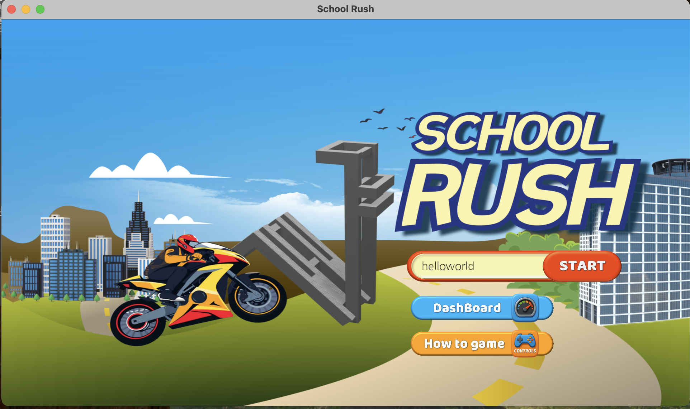
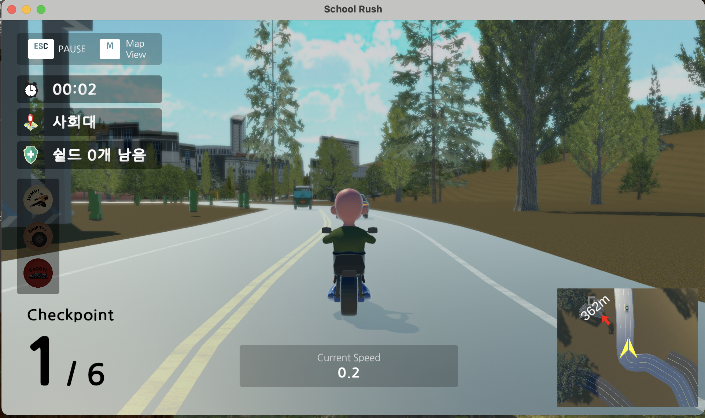
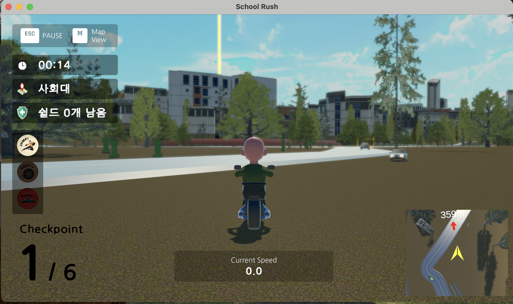
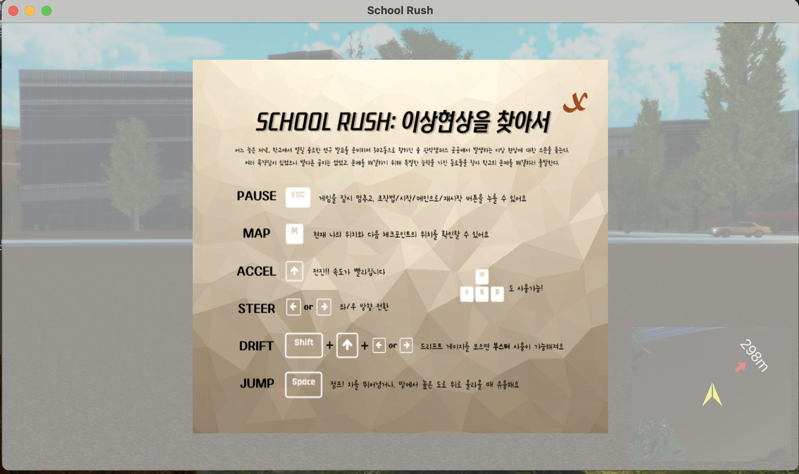
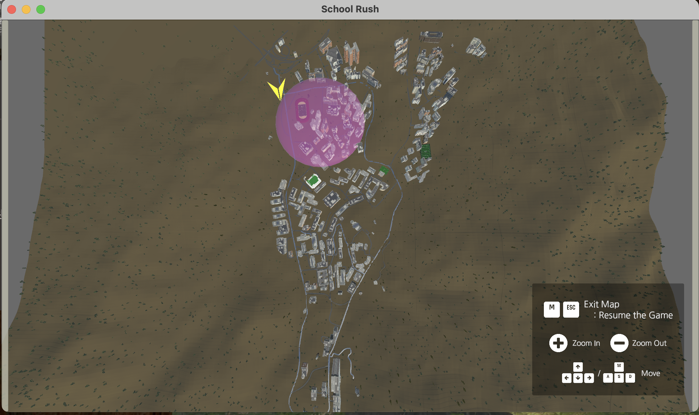
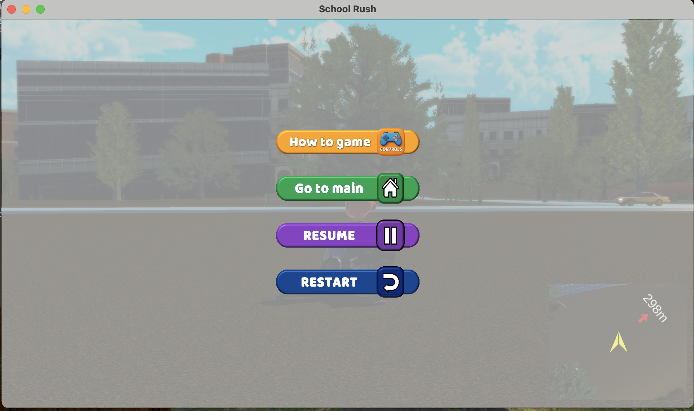
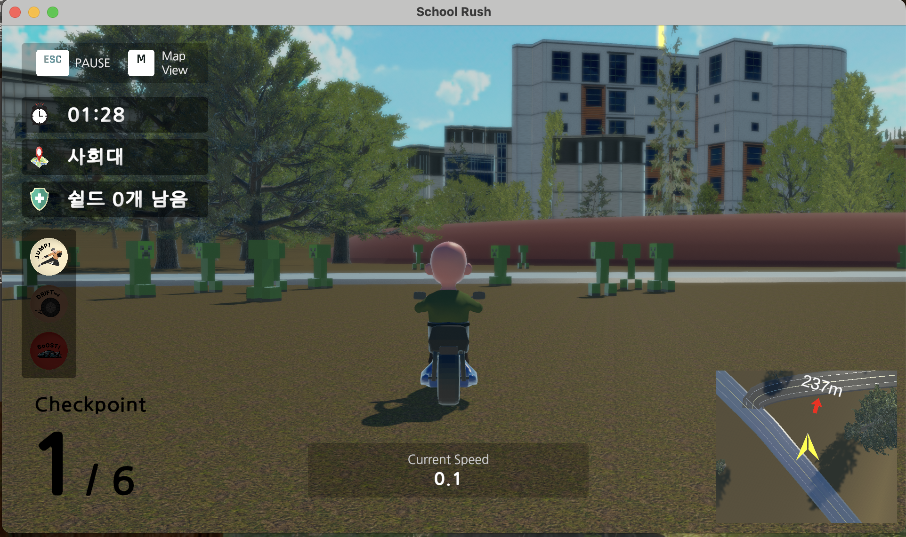
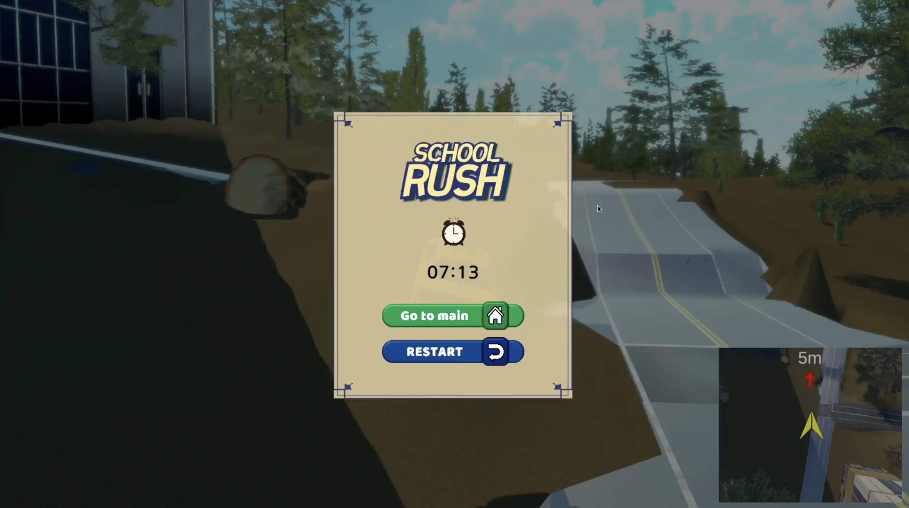

# 2025년 봄학기 소프트웨어 개발의 원리와 실습 7조 게임 설명서

## 개요

아래 두 자료를 함께 확인해주시면 더 좋습니다.

- 튜토리얼: [https://schoolrush.vercel.app/tutorial](https://schoolrush.vercel.app/tutorial)
- 데모 영상: [https://youtu.be/opvmihTjYbI](https://youtu.be/opvmihTjYbI)

## UI

- FULL HD를 기준으로 UI가 구성되어, 전체화면으로 플레이할 경우 UI가 정상적으로 작동하지 않을 수 있습니다.

- 게임 시작 시 게임 조작법과 대시보드를 확인할 수 있으며, 닉네임을 입력한 후 시작 버튼을 눌러야 플레이가 시작됩니다.

- 게임 시작 시의 기본 HUD 패널에는 게임 플레이 시간, 다음 체크포인트 위치, 쉴드 갯수가 나타나며, 조작 상태창과 체크포인트 횟수(Lab), 현재 유저의 속도, 미니맵을 확인할 수 있습니다.

- 미니맵을 통해 현재 유저의 위치와 다음 체크포인트까지의 방향/거리를 확인할 수 있으며, 돌진하는 차량도 확인할 수 있습니다.
- 체크포인트의 위치는 노란색 기둥으로 멀리서도 확인할 수 있도록 설계되었으며, 체크포인트에 다다른 경우 증강을 선택할 수 있습니다. 증강에 따라 유저는 능력을 획득하며, 오토바이 뒤에 동료 에셋이 한 명씩 추가됩니다.

## 기본 조작법

- 마우스는 사용하지 않으며, 키보드 조작만으로 게임 플레이합니다.

- 전진은 upward-arrow 또는 w 키로 가능하며, 방향 조향은 left/right-arrow 또는 a/d 키로 가능합니다. 후진은 불가능하며, 전진키를 누르지 않을 때 자연스럽게 감속됩니다.
- 전진, 방향 조향 키와 shift키를 함께 누르면 드리프트가 수행되며, 드리프트를 일정 시간 지속할 경우 부스트 사용이 가능합니다. 부스트는 드리프트 해제와 동시에 작동합니다. 짧은 드리프트를 통해 연속으로 부스트 사용이 가능하며, 증강이 없는 초반 주행 시 유용하게 사용할 수 있습니다.
- 드리프트 사용 여부와 부스터 사용 가능 여부는 HUD UI 상에서의 상태창을 통해 확인할 수 있습니다.
- 도로가 아닌 곳에서는 속도가 느려지는 대신, 스페이스바를 이용해 점프할 수 있습니다. 점프 기능을 통해 차/행인 등을 피할 수 있으며, 점프 사용 가능 여부는 HUD UI 상에서의 상태창을 통해 확인할 수 있습니다.

## 기타 조작

- M키를 이용하여 전체화면 맵을 확인할 수 있습니다. 전체화면 맵에는 현재 나의 위치(노란색 화살표), 다음 체크포인트 위치(분홍색 원)가 표시됩니다. +/- 키를 이용하여 맵 확대 축소가 가능하며, 맵 내부에서의 이동은 화살표 키/wasd 키로 가능합니다.
- 전체화면 맵을 확인하는 동안은 시간이 흐르지 않으며, 게임이 일시정지합니다. M키와 esc키를 통해 전체화면 맵 상태를 종료하고 게임을 재개할 수 있습니다.
- 현재 자신의 위치와 체크포인트까지의 길을 확인함에 있어서 유저의 플레이에 있어서 중요한 기능입니다.

- esc키를 이용하여 게임을 일시정지할 수 있습니다. 다시 esc키를 눌러 게임을 재개할 수 있습니다.일시정시 시 나타난 UI에서의 버튼을 통해서도 조작법 확인/메인으로 이동/게임 재개/게임 재시작이 가능합니다.

## 충돌 패널티

- 행인(초록색 크리퍼)과 충돌할 경우, 가장 최근에 방문한 체크포인트로 돌아갑니다.

- 차량과 충돌할 경우, 일정 거리 튕겨나간 후 1~2초 조작을 못하는 ‘기절’ 상태가 됩니다.
- 차량에는 도로 위를 정상적으로 주행하는 차와 유저를 향해 돌진하는 aggresive car가 존재합니다. aggresive car의 경우, 랜덤하게 나타나므로 건물에서 갑자기 나타나거나 유저 뒤쪽에서 갑자기 나타날 수 있습니다.
- 특정 증강을 통해 쉴드를 가지고 있을 경우, 충돌 패널티를 일정 횟수 무효화할 수 있습니다.

## 기타 함정

- 통나무가 있는 곳은 유저가 가지 못하도록 막아둔 장치이며, 통나무 주변에서 바닥으로 떨어질 경우 게임을 재시작해야만 합니다.
- 잔디광장에 올라가 진입하는 경우 역시 유저가 나오지 못하는 구조로 진입 시 게임을 재시작해야만 합니다.
- 서울대입구역쪽으로의 도로도 존재하지만, 도로 밑으로 떨어지는 경우 역시 게임을 재시작해야만 합니다.

## 종료

- 마지막 체크포인트(302동)에 다다르면 게임이 종료됩니다. 유저의 플레이 타임을 확인할 수 있으며, 메인으로 이동 또는 재시작이 가능합니다.
- 종료된 기록은 자동으로 웹에 연결된 대시보드에서 게임시작 시 입력한 닉네임과 전체 플레이 타임, 증강 선택 내용, 이동 경로를 확인할 수 있습니다.

